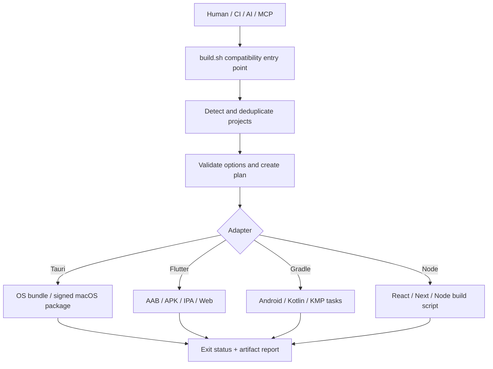
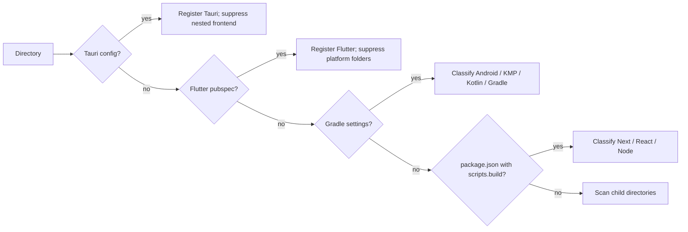
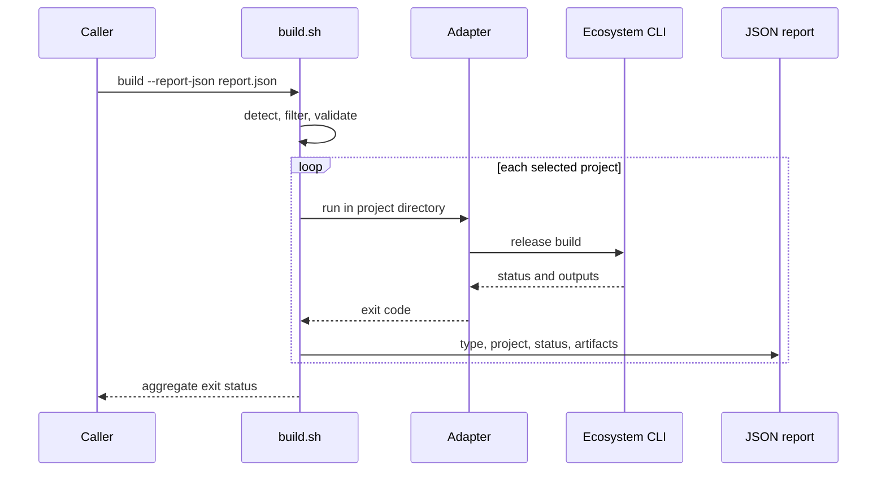
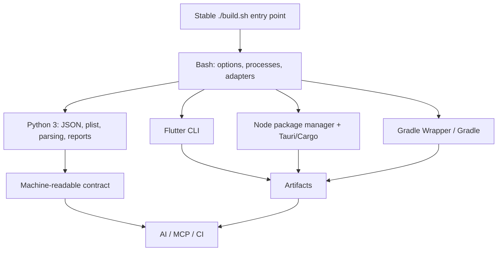
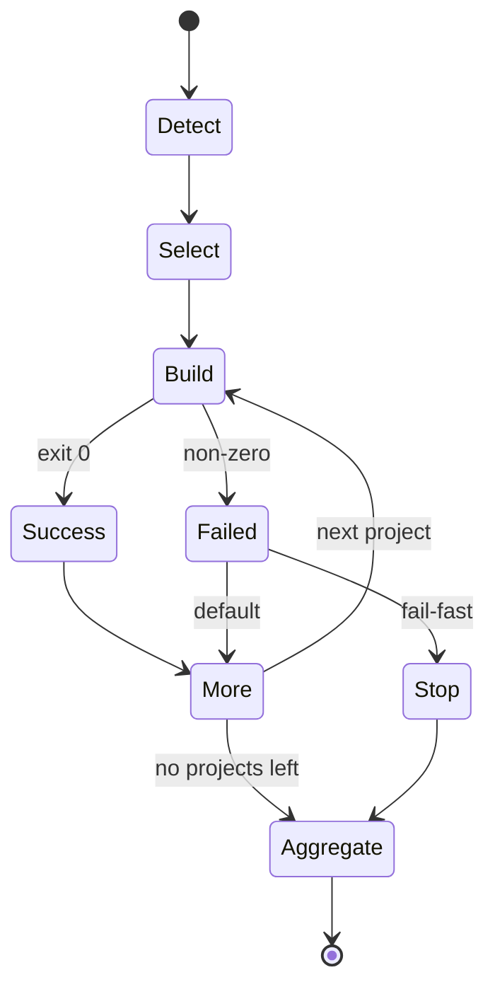
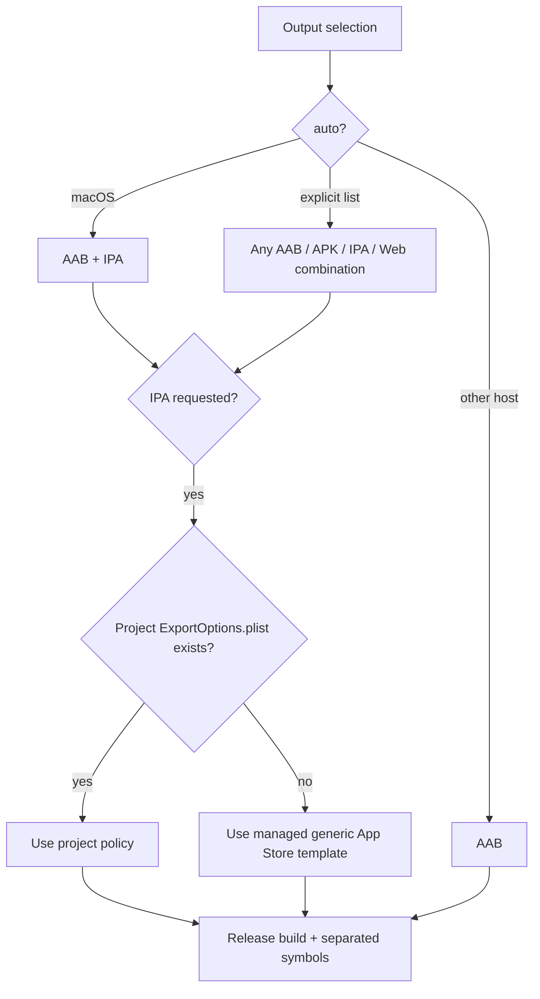
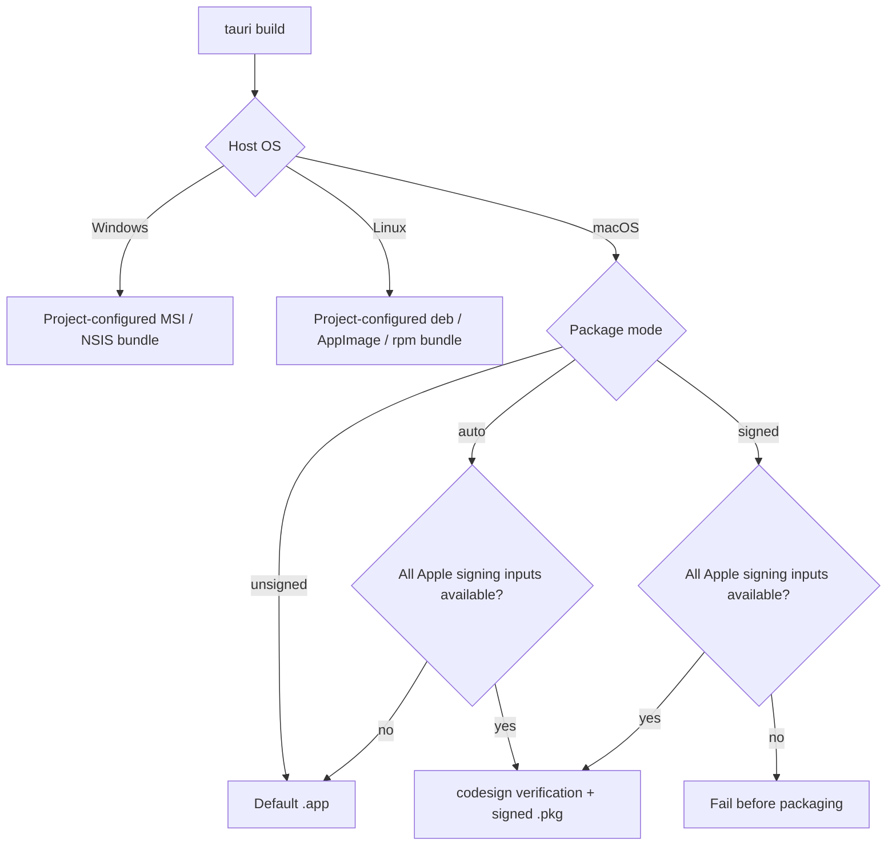
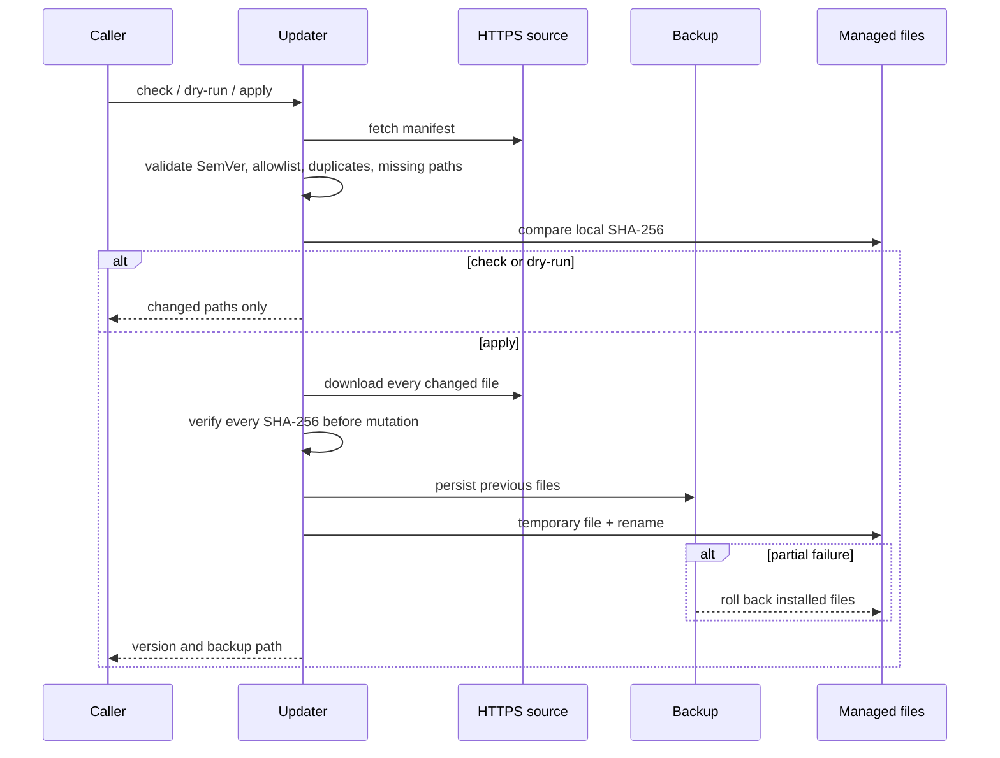
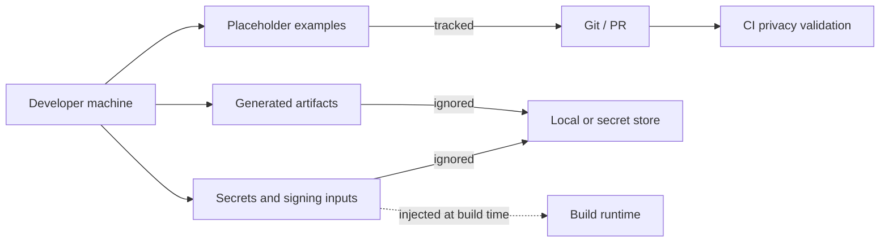

<div align="center">

# Universal Build Script

[한국어](README.md) · [English](README.en.md) · [日本語](README.ja.md) · [简体中文](README.zh-CN.md)

**One `./build.sh` entry point for Flutter, Tauri, Android/Kotlin/Gradle, React, Next.js, and Node — shared by humans, CI, AI agents, and MCP wrappers.**

[Quick start](#quick-start) · [Architecture](#architecture-and-flow) · [Commands](#commands) · [Security](#safe-runtime-updates) · [Troubleshooting](#troubleshooting)

</div>

## What it does

Universal Build Script decides whether the current directory is one project or a monorepo, detects buildable projects, removes nested duplicates, and dispatches each project to an ecosystem adapter.

| Concern | Default behavior |
|---|---|
| Interaction | Non-interactive and CI-safe |
| Version | Unchanged unless a bump is explicitly requested |
| Monorepo | Build detected projects sequentially in path order |
| Flutter | macOS: AAB + IPA; other hosts: AAB |
| Tauri | Native OS bundle; signed `.pkg` when macOS signing is complete |
| Failure | Continue independent projects, then return an aggregate failure |
| Runtime update | Never performed during a normal build |

## Quick start

Install into an application root or monorepo root:

```bash
curl -fsSL https://raw.githubusercontent.com/kimdzhekhon/Universal-Build-Script/main/install.sh | bash
```

Inspect first, then build:

```bash
./build.sh detect
./build.sh audit
./build.sh plan --json
./build.sh
```

Build selected outputs and write a machine-readable result:

```bash
./build.sh \
  --flutter-outputs appbundle,web \
  --version-bump none \
  --report-json .ubs/build-report.json
```

## Architecture and flow



### Detection precedence



Precedence is **Tauri → Flutter → Gradle → Node**. This prevents a Tauri frontend from also appearing as React and Flutter platform folders from appearing as separate Gradle projects.

### Build and report contract



### Language and responsibility boundaries



The project is intentionally not shell-only. Bash remains a portable entry point, Python handles structured data, and ecosystem CLIs own compilation and optimization.

### Monorepo failure policy



## Supported projects

| Type | Detection | Default action | Typical output |
|---|---|---|---|
| Tauri 2 | `src-tauri/tauri.conf.json` | package manager `tauri build` | native OS bundle; optional macOS `.pkg` |
| Flutter | Flutter SDK in `pubspec.yaml` | selected release outputs | AAB, split APK, IPA, Web, symbols |
| Android | Android Gradle plugin | app `bundleRelease`; otherwise `build` | project-defined Gradle outputs |
| Kotlin Multiplatform | KMP Gradle plugin | `build` | target-specific outputs |
| Kotlin/JVM or Gradle | Gradle configuration | `build` | JAR or project-defined outputs |
| Next.js / React / Node | string `scripts.build` | package manager build script | `.next`, `dist`, `build`, or project-defined |

Generated and dependency directories such as `.git`, `node_modules`, `build`, `dist`, `target`, `.gradle`, `.dart_tool`, and `.next` are excluded from recursive discovery.

## Commands

```bash
# Read-only discovery and configuration review
./build.sh detect --json /workspace
./build.sh audit --json /workspace
./build.sh plan --json /workspace

# Build one project or filtered monorepo projects
./build.sh build --project apps/mobile
./build.sh build --all --type flutter

# Explicit Flutter deliverables
./build.sh --flutter-outputs appbundle,apk,ipa,web

# Stop after the first project failure
./build.sh --fail-fast

# Structured build result
./build.sh --report-json .ubs/build-report.json
```

Important options:

| Option | Meaning |
|---|---|
| `--version-bump none|build|patch|minor|major` | App version policy |
| `--flutter-outputs auto|LIST` | `appbundle`, `apk`, `ipa`, and/or `web` |
| `--flutter-platform auto|all|ios|android` | Legacy platform selection when outputs are `auto` |
| `--project PATH` | Build exactly one detected project |
| `--all --type TYPE` | Filter monorepo projects |
| `--clean` / `--skip-clean` | Flutter cache policy |
| `--report-json PATH` | Write per-project status and discovered artifacts |

Exit code `0` means every selected project succeeded, `1` means discovery/build failure or no matching project, and `2` means invalid arguments.

## Flutter output flow



Native Flutter outputs use release mode, obfuscation, and split debug information. Web uses release optimization and tree shaking, but native Dart obfuscation does not apply to Web.

## Tauri platform flow



Package manager selection uses `packageManager`, then lock files for pnpm, Yarn, Bun, and finally npm. Frozen/immutable installation is used where supported.

## Safe runtime updates

A normal build never downloads UBS code. Update operations are explicit:

```bash
./build.sh update --check
./build.sh update --dry-run
./build.sh update
./build.sh update --check --json
./build.sh update --prune-backups 30
```



For higher-assurance CI, pin the manifest with `UBS_UPDATE_MANIFEST_SHA256`. The updater blocks path traversal, symbolic-link destinations, concurrent writers, and downgrades unless explicitly permitted. A hash pin is not a substitute for an independent signature or transparency log.

## Privacy and secret hygiene

`.gitignore` excludes real environment files, Apple/Android signing material, service configuration, caches, and generated packages. Example files must contain placeholders only.

```bash
git status --short
git check-ignore .env .env.macos signing/App.provisionprofile build/app.aab
```

Ignore rules do not erase tracked files or commit author metadata. Rotate any exposed credential before considering history rewriting.



## AI and MCP

The repository includes [`skills/universal-build`](skills/universal-build/SKILL.md). An agent should follow:

```text
detect --json → audit --json → plan --json → explicit user approval → build --report-json
```

An MCP wrapper should expose narrow typed tools for detect, audit, plan, and build. Restrict workspace roots and enum options, preserve stdout/stderr and exit codes, set timeouts, and never accept arbitrary shell fragments or signing secrets.

## Optimization audit boundaries

`audit` is static evidence, not release certification. It distinguishes release optimization, deliberate obfuscation, symbol separation, and signing. Verify actual outputs with ecosystem tools when high assurance is required; preserve Flutter symbols, Android mappings, native symbols, and required source maps.

## Validation

```bash
bash -n build.sh install.sh scripts/*.sh scripts/lib/*.sh tests/*.sh
bash tests/test-detection.sh
bash tests/test-update.sh
scripts/generate-update-manifest.sh > /tmp/update-manifest.txt
diff -u scripts/update-manifest.txt /tmp/update-manifest.txt
```

Tests use temporary fixtures and mocked ecosystem commands. Real SDK builds, Apple/Android signing, and artifact-level reverse engineering remain project-specific validation steps.

## Troubleshooting

- Not detected: confirm the framework marker and run `./build.sh detect`.
- macOS auto mode unexpectedly builds iOS: use `--flutter-platform android` or explicit outputs.
- Android flavor: set `UBS_GRADLE_TASK=:app:bundleProdRelease`.
- Tauri creates `.app` instead of `.pkg`: run with `UBS_TAURI_PACKAGE_MODE=signed` to expose missing signing inputs.
- Wrong package manager: align `packageManager` and the committed lock file.

## Known limitations

- Projects run sequentially in path order; dependency graph scheduling and parallel builds are not implemented.
- Xcode-only native iOS projects are not detected.
- Gradle flavors, custom release tasks, and KMP deployment tasks may require overrides.
- Tauri JS obfuscation assumes a `dist/` frontend output.
- Artifact reporting searches known default output locations.
- The update manifest supports external hash pinning but not an independent signature/transparency log.

## License

MIT License — Copyright © 2024–2026 kimdzhekhon. See [LICENSE](LICENSE).
