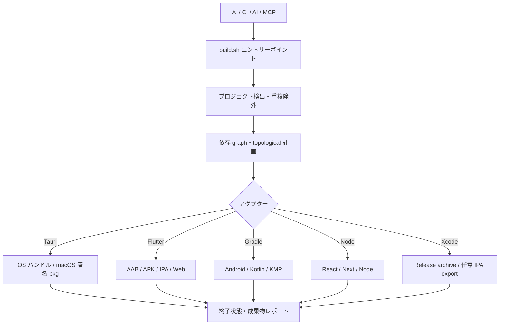
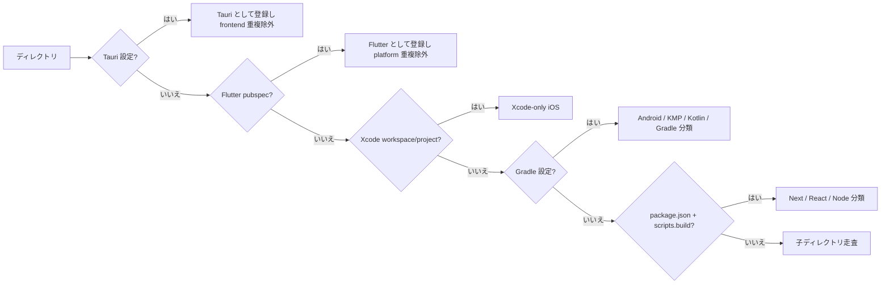
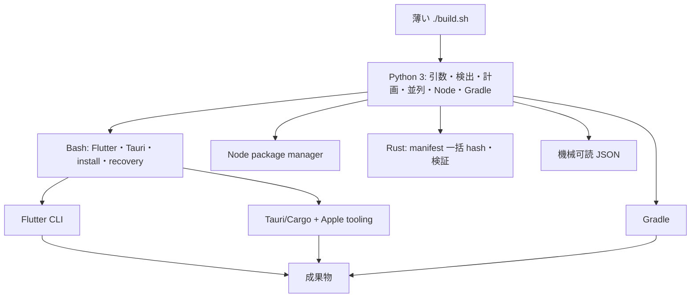
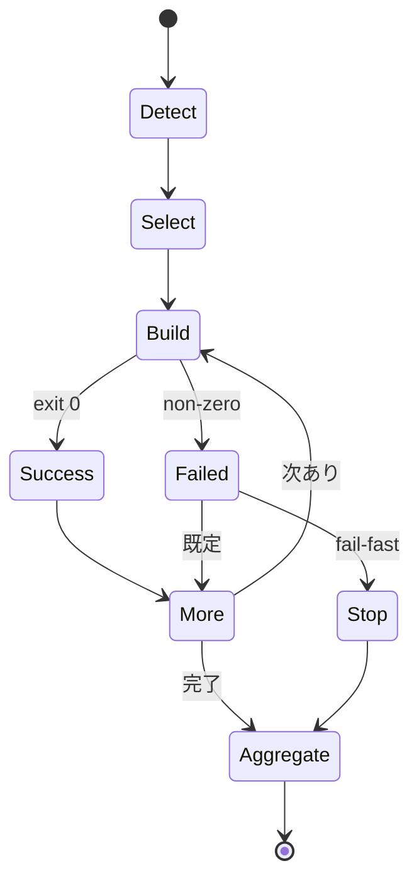
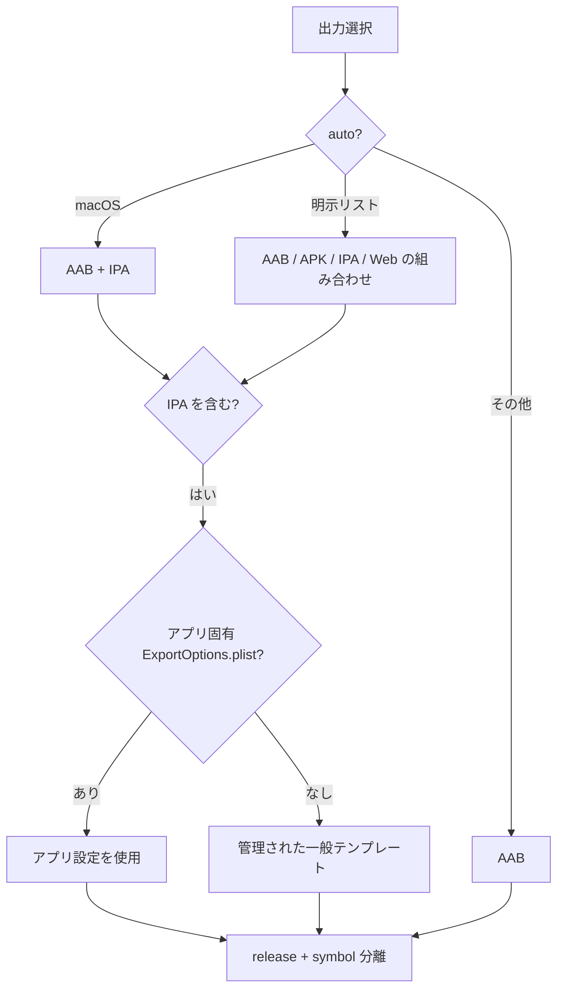
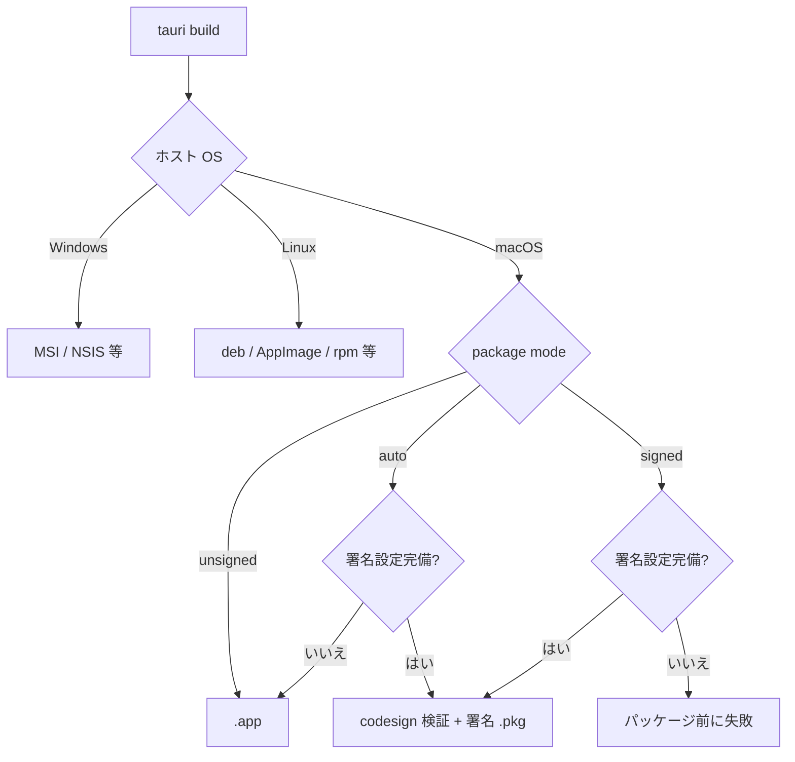
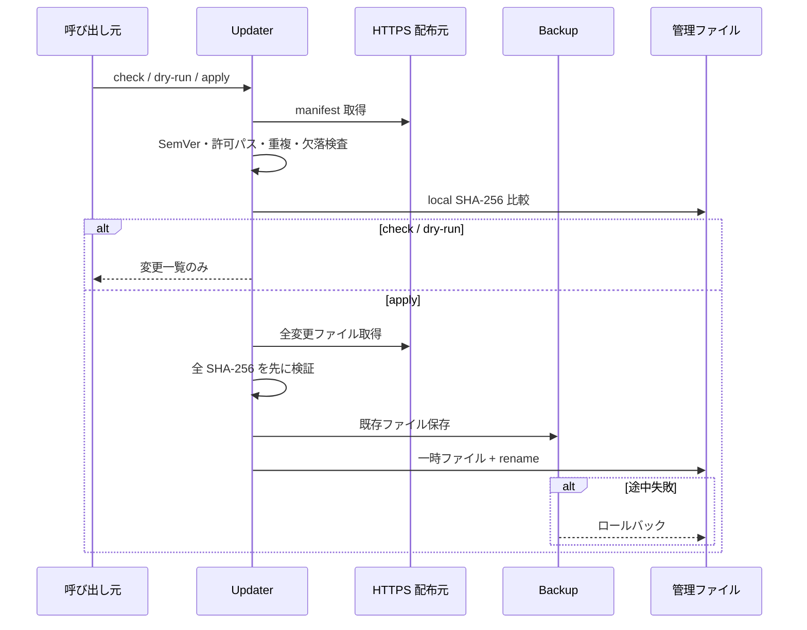
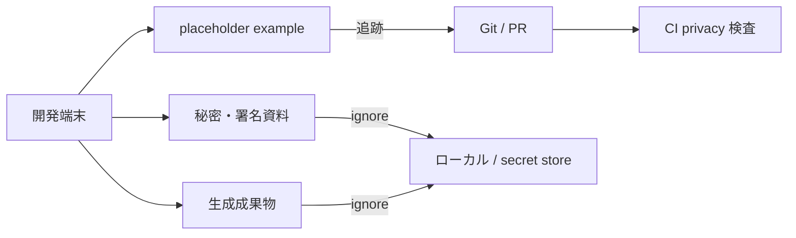

<div align="center">

# Universal Build Script

[한국어](README.md) · [English](README.en.md) · [日本語](README.ja.md) · [简体中文](README.zh-CN.md)

**`./build.sh` 一つで Flutter・Tauri・Xcode iOS・Android/Kotlin/Gradle・React/Next/Node を検出し、人・CI・AI・MCP が同じ手順でビルドするオーケストレーター**

[クイックスタート](#クイックスタート) · [構成](#構成と処理フロー) · [コマンド](#主なコマンド) · [安全な更新](#安全なランタイム更新) · [制限事項](#既知の制限事項)

</div>

## 概要

現在のディレクトリが単一プロジェクトかモノレポかを判定し、ビルド可能なプロジェクトを検出して、重複する内部プロジェクトを除外したうえで適切なアダプターを実行します。

3.3 では Python 3 が Node workspace、Flutter path、Gradle composite、明示設定から依存関係を推論し、topological layer 順に実行します。Xcode-only iOS adapter と、外部 package 不要の root 制限付き stdio MCP server も含みます。

| 観点 | 既定動作 |
|---|---|
| 実行 | 非対話・CI セーフ |
| バージョン | 明示しない限り変更しない |
| モノレポ | 依存関係の topological 順にビルド |
| Flutter | macOS は AAB+IPA、その他は AAB |
| Tauri | OS 標準バンドル、macOS 署名完備時は `.pkg` |
| 失敗 | 他プロジェクトを続行し最後に集計 |
| UBS 更新 | 通常ビルドとは完全に分離 |

## クイックスタート

```bash
curl -fsSL https://raw.githubusercontent.com/kimdzhekhon/Universal-Build-Script/main/install.sh | bash

./build.sh detect
./build.sh audit
./build.sh plan --json
./build.sh graph --json
./build.sh
```

Python 3.9 以上は必須、Rust は任意です。

```bash
./scripts/build-rust-helper.sh
# または install.sh を UBS_BUILD_RUST_HELPER=true で実行
```

> **2.x から 3.x への更新:** `UBS_FORCE=true` で installer を一度実行してください。3.x 以降は `./build.sh update` が 25 個の管理ファイルを更新します。

installer は不変の current release ref を既定で使います。`UBS_INSTALL_REF`、`UBS_JOBS`、`UBS_INSTALL_MODE`、`UBS_MANAGE_GITIGNORE`、`UBS_GRADLE_FLAGS`、`UBS_GRADLE_OPTIMIZE` を設定できます。

成果物レポートを含む例:

```bash
./build.sh \
  --flutter-outputs appbundle,web \
  --version-bump none \
  --report-json .ubs/build-report.json
```

## 構成と処理フロー



### 検出優先順位



優先順位は **Tauri → Flutter → Xcode → Gradle → Node** です。Tauri/Flutter 内部 project を二重検出しません。

### 言語の役割分担



`--jobs N` で独立 project を制限付き並列実行できます。Node は package/lock 入力が同じ場合 install を省略し、`UBS_INSTALL_MODE=always` で再実行できます。Rust helper がなければ portable fallback を使います。

### モノレポの失敗ポリシー



## 対応プロジェクト

| 種類 | 検出条件 | 既定ビルド | 主な成果物 |
|---|---|---|---|
| Tauri 2 | `src-tauri/tauri.conf.json` | `tauri build` | OS 標準バンドル、macOS `.pkg` |
| Flutter | Flutter SDK を宣言した `pubspec.yaml` | 選択した release 出力 | AAB、分割 APK、IPA、Web、symbols |
| Xcode iOS | `*.xcworkspace` / `*.xcodeproj` | Release archive | XCArchive、任意 IPA |
| Android | Android Gradle plugin | app は `bundleRelease` | Gradle 設定依存 |
| Kotlin/KMP/Gradle | Gradle plugin・settings | `build` | JAR・ターゲット別成果物 |
| Next/React/Node | 文字列の `scripts.build` | package manager build | `.next`、`dist`、`build` 等 |

`.git`、`node_modules`、`build`、`dist`、`target`、`.gradle`、`.dart_tool`、`.next` は再帰検出から除外します。

## 主なコマンド

```bash
./build.sh detect --json /workspace
./build.sh audit --json /workspace
./build.sh plan --json /workspace
./build.sh graph --json /workspace

./build.sh build --project apps/mobile
./build.sh build --all --type flutter
./build.sh --flutter-outputs appbundle,apk,ipa,web
./build.sh --fail-fast
./build.sh --report-json .ubs/build-report.json
```

| オプション | 内容 |
|---|---|
| `--version-bump none|build|patch|minor|major` | バージョン方針 |
| `--flutter-outputs auto|LIST` | AAB/APK/IPA/Web の組み合わせ |
| `--project PATH` | 指定 project と検出された先行依存 project を実行 |
| `--all --type TYPE` | モノレポを種類で絞り込み |
| `--clean` / `--skip-clean` | Flutter キャッシュ方針 |
| `--report-json PATH` | プロジェクト別状態・成果物を保存 |

終了コードは、全成功が `0`、検出/ビルド失敗または対象なしが `1`、不正引数が `2` です。

## Flutter 出力



ネイティブ出力には release、obfuscation、split debug info を適用します。Flutter Web は release 最適化対象ですが、ネイティブ Dart obfuscation の対象ではありません。

## Tauri 出力



## 安全なランタイム更新

通常ビルドは UBS コードをダウンロードしません。

```bash
./build.sh update --check
./build.sh update --dry-run
./build.sh update
./build.sh update --check --json
./build.sh update --prune-backups 30
```



パストラバーサル、シンボリックリンク先、同時更新、許可されない downgrade を遮断します。`UBS_UPDATE_MANIFEST_SHA256` で manifest を外部固定できますが、独立署名の代替ではありません。

## 秘密情報と成果物

`.gitignore` は実 `.env`、Apple/Android 署名資料、サービス設定、キャッシュ、生成パッケージを除外します。example ファイルにはプレースホルダーだけを保存してください。



Ignore は既に追跡されたファイルやコミット作成者情報を消去しません。漏えいした資格情報は履歴操作より先に無効化・再発行してください。

## AI・MCP

同梱の [`skills/universal-build`](skills/universal-build/SKILL.md) は次の安全な順序を使用します。

```text
detect --json → audit --json → plan --json → 明示承認 → build --report-json
```

`python3 /ABSOLUTE/PATH/scripts/ubs_mcp.py` で外部 package 不要の stdio server を起動し、`UBS_MCP_ROOT` で許可 workspace を固定できます。既定 tool は `ubs_detect`、`ubs_audit`、`ubs_plan`、`ubs_graph`、`ubs_update_check` のみです。`ubs_build` は `UBS_MCP_ALLOW_BUILD=true` の場合だけ公開され、実 build は `confirm=true` も必要です。

### 依存 graph と Xcode

`./build.sh graph --json` は Node package、Flutter `path:`、Gradle `includeBuild(...)` と `ubs.dependencies.json` から `nodes`・`edges`・topological `layers` を返します。循環と workspace 外 path は拒否します。

```json
{"schema_version":1,"dependencies":{"apps/web":["packages/ui"]}}
```

Xcode-only root は `ios-xcode` として検出し、macOS で Release archive を作成します。複数 scheme は `UBS_XCODE_SCHEME`、IPA export は `UBS_XCODE_EXPORT=true` と `UBS_XCODE_EXPORT_OPTIONS` を指定します。

## 検証

```bash
bash -n build.sh install.sh scripts/*.sh scripts/lib/*.sh tests/*.sh
python3 tests/test_python_core.py
python3 tests/test_mcp.py
bash tests/test-detection.sh
bash tests/test-install.sh
bash tests/test-python-adapters.sh
bash tests/test-update.sh
bash tests/test-rust-helper.sh
```

テストは一時 fixture とモック CLI を使います。実 SDK、署名、成果物レベルの逆解析確認は各プロジェクトで別途必要です。

## 既知の制限事項

- 既定は逐次実行です。`--jobs N` は各 topological layer 内の非競合 project だけを並列化します。
- 自動依存推論外の生成 code・custom task 関係は `ubs.dependencies.json` が必要です。
- 複数 Xcode scheme が曖昧な場合は `UBS_XCODE_SCHEME` が必要です。
- Gradle flavor、カスタム task、KMP 配布 task は override が必要な場合があります。
- Tauri JS 難読化は frontend の `dist/` を前提にします。
- 成果物レポートは既知の標準出力パスを検索します。
- 更新 manifest は外部 hash pin を提供しますが、独立署名・透明性ログはありません。

## ライセンス

MIT License — Copyright © 2024–2026 kimdzhekhon. 詳細は [LICENSE](LICENSE) を参照してください。
