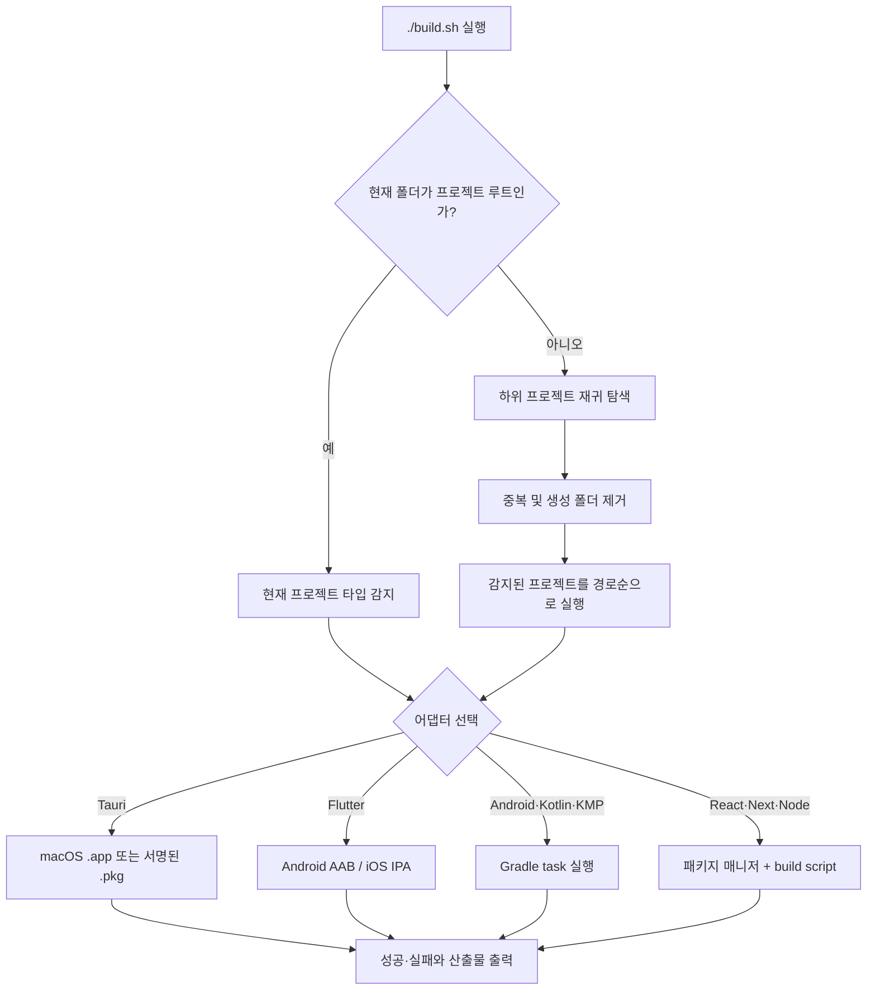

<div align="center">

# Universal Build Script

**`./build.sh` 하나로 Flutter·Tauri를 우선 감지하고 Android/Kotlin·React/Node 프로젝트까지 빌드하는 Bash 오케스트레이터**


[빠른 시작](#빠른-시작) · [지원 범위](#지원-범위) · [명령과 옵션](#명령과-옵션) · [문제 해결](#문제-해결)

</div>

---

## 한눈에 보기

Universal Build Script는 현재 디렉터리가 단일 프로젝트인지 모노레포 루트인지 판단한 뒤, 감지된 프로젝트를 알맞은 빌드 어댑터로 연결합니다.

```bash
./build.sh
```

인자 없이 실행하면 다음 안전한 기본값을 사용합니다.

| 항목 | 기본 동작 |
|---|---|
| 실행 방식 | 비대화형 |
| 앱 버전 | 변경하지 않음 |
| 단일 프로젝트 | 현재 프로젝트만 빌드 |
| 모노레포 루트 | 하위 프로젝트를 찾아 경로순으로 모두 빌드 |
| Flutter 플랫폼 | macOS: Android+iOS, 그 외: Android |
| Flutter 캐시 | `flutter clean`을 생략하고 기존 캐시 유지 |
| Tauri 패키징 | 서명 설정 완전: `.pkg`, 불완전: `.app` |
| 여러 프로젝트 중 하나 실패 | 나머지를 계속 실행하고 마지막에 집계 |
| 원격 자가 업데이트 | 기본 차단 |

> 사용자 진입점은 루트의 `./build.sh`입니다. `scripts/` 아래 파일은 내부 어댑터이므로 직접 실행할 필요가 없습니다.

## 빠른 시작

### 설치

빌드하려는 단일 프로젝트 루트 또는 모노레포 루트에서 실행합니다.

```bash
curl -fsSL https://raw.githubusercontent.com/kimdzhekhon/Universal-Build-Script/main/install.sh | bash
```

설치 프로그램은 모노레포에서도 사용할 수 있도록 모든 어댑터를 함께 설치합니다. 기존 UBS 파일은 기본적으로 보존됩니다. 기존 파일까지 갱신하려면 다음처럼 실행합니다.

```bash
curl -fsSL https://raw.githubusercontent.com/kimdzhekhon/Universal-Build-Script/main/install.sh \
  | UBS_FORCE=true bash
```

### 실행

```bash
./build.sh
```

실제 빌드 전에 감지 결과만 확인하고 싶다면:

```bash
./build.sh detect
./build.sh --dry-run
```

버전과 Flutter 플랫폼을 메뉴에서 직접 선택하려면:

```bash
./build.sh --interactive
```

## 실행 흐름



## 지원 범위

감지 순서는 **Tauri → Flutter → Gradle → Node**입니다. 상위 생태계를 먼저 확인해 Tauri가 React로, Flutter가 Android 프로젝트로 중복 감지되는 것을 방지합니다.

| 타입 | 감지 기준 | 기본 빌드 | 주요 산출물 |
|---|---|---|---|
| Tauri 2 | `src-tauri/tauri.conf.json` | 패키지 매니저의 `tauri build` | `.app`, 조건 충족 시 `.pkg` |
| Flutter | Flutter SDK가 선언된 `pubspec.yaml` | `flutter build appbundle/ipa` | AAB, IPA, 디버그 심볼 |
| Android | Gradle의 `com.android.application/library` | 앱: `bundleRelease`, 그 외: `build` | Gradle 프로젝트 설정에 따름 |
| Kotlin Multiplatform | Kotlin Multiplatform Gradle 플러그인 | `build` | 타깃별 Gradle 산출물 |
| Kotlin/JVM | Kotlin Gradle 플러그인 | `build` | JAR 등 프로젝트 설정에 따름 |
| 일반 Gradle | Gradle 프로젝트 파일 | `build` | 프로젝트 설정에 따름 |
| Next.js | `package.json`의 `next` + `scripts.build` | `<pm> run build` | 일반적으로 `.next/` |
| React | `package.json`의 `react` + `scripts.build` | `<pm> run build` | Vite 등 도구 설정에 따름 |
| 일반 Node | `package.json`의 `scripts.build` | `<pm> run build` | build script 설정에 따름 |

### 중복 감지 방지

- Tauri 루트에 있는 React/Vite 프런트엔드는 별도 React 프로젝트로 등록하지 않습니다.
- Flutter 내부 `android/`, `ios/`, `macos/`, `linux/`, `windows/`, `web/`은 별도 프로젝트로 등록하지 않습니다.
- 모노레포의 형제 디렉터리에 있는 앱들은 각각 독립 프로젝트로 감지합니다.
- `.git`, `node_modules`, `build`, `dist`, `target`, `.gradle`, `.dart_tool`, `.next`는 재귀 탐색에서 제외합니다.
- `package.json`에 `build` script가 없는 Node 패키지는 빌드 대상에서 제외합니다.

## 명령과 옵션

### 자주 쓰는 명령

```bash
# 단일 앱 또는 모노레포 전체 자동 빌드
./build.sh

# 감지 목록만 출력
./build.sh detect

# 실제 실행 없이 계획 확인
./build.sh --dry-run

# 특정 프로젝트만 빌드
./build.sh build --project apps/mobile

# 특정 타입만 빌드
./build.sh build --all --type flutter
./build.sh build --all --type react

# 실패 즉시 전체 실행 중단
./build.sh --fail-fast
```

### 공통 옵션

| 옵션 | 설명 |
|---|---|
| `detect [경로]` | 지정 경로 아래의 프로젝트 목록 출력 |
| `--dry-run` | 어댑터를 실행하지 않고 빌드 계획만 출력 |
| `--interactive` | Flutter/Tauri 버전과 Flutter 플랫폼 선택 메뉴 사용 |
| `--non-interactive` | 안전한 기본값으로 무인 실행. 현재 기본값 |
| `--project <경로>` | 지정한 프로젝트 하나만 감지하고 빌드 |
| `--all` | 지정 루트 아래 감지된 프로젝트 전체 빌드 |
| `--type <타입>` | 전체 빌드에서 정확히 일치하는 타입만 선택 |
| `--version-bump <정책>` | `none`, `build`, `patch`, `minor`, `major` |
| `--flutter-platform <값>` | `auto`, `all`, `ios`, `android` |
| `--clean` | Flutter 빌드 전에 `flutter clean` 실행 |
| `--skip-clean` | Flutter 빌드 캐시 유지. 현재 기본값 |
| `--fail-fast` | 첫 실패에서 전체 빌드 중단 |

> `build` 버전 정책은 Flutter의 build number 전용입니다. Tauri가 포함된 모노레포 전체에 `--version-bump build`를 적용하면 Tauri 어댑터는 지원하지 않는 정책으로 실패합니다.

### 종료 코드와 실패 처리

| 종료 코드 | 의미 |
|---:|---|
| `0` | 선택된 모든 프로젝트 성공 |
| `1` | 감지 실패, 빌드 실패 또는 선택 대상 없음 |
| `2` | 잘못된 옵션이나 지원하지 않는 값 |

`--fail-fast`가 없으면 프로젝트 하나가 실패해도 다음 프로젝트를 계속 빌드합니다. 마지막 결과에서 전체·성공·실패 개수를 확인할 수 있습니다.

Flutter와 Tauri의 버전을 올린 뒤 빌드가 실패하거나 취소되면 원래 버전으로 자동 복원합니다. 성공한 경우에만 새 버전을 유지합니다.

## Flutter 빌드

### 요구 사항

- Flutter SDK와 `flutter` 명령
- Android 빌드: Android SDK 및 서명 설정
- iOS 빌드: macOS, Xcode, Apple 서명 설정
- iOS 내보내기: `ios/ExportOptions.plist`

### 기본 동작

```text
버전 정책 적용
  → 선택적으로 flutter clean
  → flutter pub get
  → Android AAB 및/또는 iOS IPA 릴리스 빌드
  → 결과 경로와 소요 시간 출력
```

- 기본 버전 정책은 `none`입니다.
- 기본 플랫폼 `auto`는 macOS에서 Android+iOS, 그 외 운영체제에서 Android를 선택합니다.
- `.env.prod`가 있으면 우선 사용하고, 없으면 `.env`를 사용합니다.
- 두 파일이 모두 없으면 `dart-define` 없이 빌드합니다.
- `--obfuscate`, `--split-debug-info`, `--tree-shake-icons`를 적용합니다.

### 결과물

| 대상 | 경로 |
|---|---|
| Android AAB | `build/app/outputs/bundle/release/app-release.aab` |
| Android 디버그 심볼 | `build/app/outputs/symbols/` |
| iOS IPA | `build/ios/ipa/*.ipa` |
| iOS 디버그 심볼 | `build/ios/outputs/symbols/` |

## Tauri macOS 빌드

현재 Tauri 어댑터는 **macOS 전용**입니다. Windows/Linux에서 Tauri 프로젝트를 감지하면 지원 범위를 설명하고 실패합니다.

### 요구 사항

- Tauri 2 프로젝트와 `src-tauri/tauri.conf.json`
- Node.js와 프로젝트가 사용하는 패키지 매니저
- Rust/Tauri 빌드 환경
- `.pkg` 생성 시 Apple 인증서, provisioning profile, entitlements

### 패키지 모드

`UBS_TAURI_PACKAGE_MODE`로 결과물을 제어합니다.

| 값 | 동작 |
|---|---|
| `auto` | 기본값. 서명 설정이 완전하면 `.pkg`, 아니면 `.app` 생성 |
| `signed` | `.pkg` 필수. 서명 설정이 하나라도 없으면 빌드 전에 실패 |
| `unsigned` | Apple 서명 후처리를 건너뛰고 `.app` 생성 |

서명된 `.pkg`에 필요한 값:

```bash
TAURI_SIGN_IDENTITY="Apple Distribution: Your Name (TEAMID)"
TAURI_INSTALLER_IDENTITY="3rd Party Mac Developer Installer: Your Name (TEAMID)"
TAURI_PROVISION_PROFILE=signing/App.provisionprofile
TAURI_ENTITLEMENTS=signing/app.entitlements
```

경로 두 개는 생략할 수 있습니다. 생략하면 `signing/*.provisionprofile`, `signing/*.entitlements`의 첫 번째 파일을 사용합니다.

서명 직전에는 provisioning profile과 `.app` 번들의 quarantine/확장 속성을 `xattr -cr`로 제거해 App Store 검증 오류 가능성을 줄입니다.

### 패키지 매니저 선택

Tauri와 React/Node 어댑터는 같은 선택 규칙을 사용합니다.

1. `package.json`의 `packageManager` 필드
2. `pnpm-lock.yaml`
3. `yarn.lock`
4. `bun.lock` 또는 `bun.lockb`
5. 그 외에는 npm

선택된 명령이 설치되어 있지 않으면 명확한 오류를 출력하고 중단합니다. npm lock 파일이 있으면 `npm ci`, pnpm/bun lock 파일이 있으면 frozen 설치를 사용하며 Yarn Berry는 `--immutable`을 사용합니다.

### 결과물

| 모드 | 경로 |
|---|---|
| `.app` | `src-tauri/target/release/bundle/macos/<productName>.app` |
| 서명된 `.pkg` | `signing/build/<productName>.pkg` |

서명된 `.pkg`는 Transporter를 통해 App Store Connect에 제출할 수 있습니다.

## Android·Kotlin·Gradle 빌드

Gradle Wrapper가 실행 가능하면 `./gradlew`를 사용하고, 없으면 시스템 `gradle`을 사용합니다.

| 감지 결과 | 기본 task |
|---|---|
| Android application | `bundleRelease` |
| Android library | `build` |
| Kotlin/JVM | `build` |
| Kotlin Multiplatform | `build` |
| 일반 Gradle | `build` |

product flavor, 커스텀 variant 또는 특정 모듈 task가 필요하면 직접 지정합니다.

```bash
UBS_GRADLE_TASK=:app:bundleProdRelease ./build.sh
```

## React·Next·Node 빌드

감지된 패키지 매니저로 의존성을 설치한 다음 `scripts.build`를 실행합니다.

```bash
# 기본 build 대신 build:production 실행
UBS_NODE_BUILD_SCRIPT=build:production ./build.sh

# 이미 의존성이 준비된 CI 또는 로컬 환경
UBS_SKIP_INSTALL=true ./build.sh
```

산출물 위치는 Vite, Next.js, CRA 등 프로젝트의 build script 설정을 따릅니다.

## 환경변수

### UBS 공통 설정

| 환경변수 | 기본값 | 설명 |
|---|---|---|
| `UBS_NON_INTERACTIVE` | `true` | 무인 실행 여부 |
| `UBS_VERSION_BUMP` | `none` | 버전 정책 |
| `UBS_FLUTTER_PLATFORM` | `auto` | Flutter 대상 플랫폼 |
| `UBS_SKIP_CLEAN` | `true` | Flutter clean 생략 |
| `UBS_SKIP_INSTALL` | `false` | Node 의존성 설치 생략 |
| `UBS_GRADLE_TASK` | 자동 | Gradle task 강제 지정 |
| `UBS_NODE_BUILD_SCRIPT` | `build` | Node build script 이름 |
| `UBS_TAURI_PACKAGE_MODE` | `auto` | Tauri `.app`/`.pkg` 정책 |
| `UBS_NO_NOTIFY` | `false` | macOS 알림과 결과 폴더 열기 생략 |
| `UBS_ALLOW_SELF_UPDATE` | `false` | 대화형 모드에서 Flutter/Tauri 어댑터 원격 업데이트 확인 허용 |
| `UBS_FORCE` | `false` | 설치 프로그램에서 기존 UBS 파일 덮어쓰기 |

### Tauri 전용 설정

`.env.macos`에서는 다음 키만 읽습니다.

- `TAURI_SIGN_IDENTITY`
- `TAURI_INSTALLER_IDENTITY`
- `TAURI_PROVISION_PROFILE`
- `TAURI_ENTITLEMENTS`
- `TAURI_OBFUSCATE_JS`

`.env.macos`는 `source`로 실행하지 않고 허용된 값을 문자열로 파싱합니다. 셸 표현식이나 명령 치환은 실행되지 않습니다.

## 환경변수와 보안

- Flutter의 `dart-define` 값은 컴파일된 앱에서 추출될 수 있습니다.
- React/Vite의 `VITE_*` 값은 프런트엔드 번들에 포함됩니다.
- Supabase anon key처럼 공개 사용을 전제로 한 값만 클라이언트 빌드에 넣고, 서버 비밀키·service-role key·개인 API key는 넣지 마십시오.
- `.env`, `.env.prod`, `.env.macos`, provisioning profile 및 entitlements는 저장소 정책에 맞게 보호하십시오.
- 원격 자가 업데이트는 기본적으로 꺼져 있습니다. `UBS_ALLOW_SELF_UPDATE=true ./build.sh --interactive`로 명시적으로 허용하면 원격 스크립트가 현재 어댑터를 교체할 수 있습니다.
- `curl | bash` 설치는 원격 스크립트를 즉시 실행합니다. 민감한 환경에서는 `install.sh`를 먼저 내려받아 검토한 다음 실행하십시오.

## 난독화와 최적화

### Flutter

- Dart AOT 릴리스 빌드
- `--obfuscate`로 Dart 심볼 난독화
- `--split-debug-info`로 디버그 심볼 분리
- Android에서 `--tree-shake-icons` 적용

### Tauri

- Rust 코드는 네이티브 바이너리로 컴파일됩니다.
- 프런트엔드는 사용하는 빌드 도구의 기본 minify와 tree-shaking을 따릅니다.
- `TAURI_OBFUSCATE_JS=true`이면 `dist/`를 `javascript-obfuscator`로 추가 처리합니다.
- 이 옵션은 프런트엔드 출력 폴더가 `dist/`인 프로젝트를 전제로 합니다.

Rust 바이너리 크기를 더 줄이고 싶다면 프로젝트의 `Cargo.toml`에서 release profile을 직접 검토하십시오. 최적화 수준, LTO, strip은 빌드 시간과 디버깅 가능성에 영향을 주므로 이 스크립트가 강제하지 않습니다.

## 아키텍처

```text
Universal-Build-Script/
├── build.sh                         # 사용자 진입점·실행 집계
├── install.sh                       # 전체 런타임 설치
├── scripts/
│   ├── lib/
│   │   ├── detect.sh                # 프로젝트 감지·모노레포 탐색
│   │   └── node-package-manager.sh  # npm/pnpm/yarn/bun 공통 처리
│   ├── build-flutter.sh             # Flutter AAB/IPA
│   ├── build-tauri-macos.sh         # Tauri macOS app/pkg
│   ├── build-gradle.sh              # Android/Kotlin/Gradle
│   ├── build-node.sh                # React/Next/Node
│   ├── FLUTTER_VERSION
│   └── TAURI_VERSION
├── ios/ExportOptions.plist
├── tests/test-detection.sh
├── .env.example
└── .env.macos.example
```

어댑터는 프로젝트 디렉터리를 현재 작업 디렉터리로 받아 실행됩니다. 새 생태계를 추가할 때는 감지 규칙과 어댑터 매핑을 확장하는 방식입니다.

## 테스트

```bash
bash tests/test-detection.sh
```

현재 테스트는 임시 모노레포를 만들고 다음을 검증합니다.

- Tauri+React를 Tauri 하나로 감지
- Flutter 내부 Android 중복 제거
- 독립 Android, Kotlin Multiplatform, React 감지
- 인자 없는 `./build.sh`의 모노레포 자동 전환
- dry-run 프로젝트 수
- Android 기본 `bundleRelease` 선택
- npm lock 파일의 `npm ci` 선택
- Flutter 성공 시 버전 유지 및 실패 시 원상 복구
- `.env`가 없는 Flutter 실행 경로
- `.env.macos`의 명령 치환이 실행되지 않음
- 서명 설정이 없는 Tauri의 `.app` 대체 경로
- Tauri signed 모드의 quarantine 속성 제거와 `.pkg` 생성

테스트는 실제 Flutter SDK, Gradle, npm, Apple 인증서를 사용하지 않고 모의 명령으로 실행됩니다. 실제 AAB·IPA·PKG 생성은 각 프로젝트 환경에서 별도로 확인해야 합니다.

## 문제 해결

### 프로젝트가 감지되지 않음

```bash
./build.sh detect
```

- Flutter는 `pubspec.yaml`에 Flutter SDK 선언이 있어야 합니다.
- Node는 `package.json`에 문자열 형태의 `scripts.build`가 있어야 합니다.
- 재귀 Gradle 탐색은 `settings.gradle` 또는 `settings.gradle.kts`를 프로젝트 루트 기준으로 사용합니다.

### Flutter가 iOS까지 빌드해서 실패함

macOS의 `auto` 기본값은 Android+iOS입니다. Android만 필요하면:

```bash
./build.sh --flutter-platform android
```

### Android flavor task를 찾지 못함

```bash
UBS_GRADLE_TASK=:app:bundleProdRelease ./build.sh
```

### Tauri에서 `.pkg` 대신 `.app`만 생성됨

서명 identity, provisioning profile, entitlements 중 하나 이상이 없습니다. 누락을 즉시 확인하려면:

```bash
UBS_TAURI_PACKAGE_MODE=signed ./build.sh
```

### 패키지 매니저를 찾지 못함

`package.json`의 `packageManager` 필드 또는 lock 파일이 선택한 npm/pnpm/yarn/bun 명령을 설치하십시오. `packageManager` 선언과 실제 lock 파일도 일치시키는 것이 좋습니다.

### 전체 빌드 중 한 프로젝트 실패

기본값은 나머지 프로젝트를 계속 실행합니다. 첫 실패에서 멈추려면:

```bash
./build.sh --fail-fast
```

## 알려진 제한 사항

- 프로젝트 간 `dependsOn` 관계를 계산하지 않으며 경로순으로 순차 실행합니다.
- 서로 독립적인 프로젝트의 병렬 실행은 아직 지원하지 않습니다.
- Tauri 어댑터는 현재 macOS 전용입니다.
- Xcode-only 네이티브 iOS 프로젝트는 감지하지 않습니다.
- Gradle product flavor와 커스텀 task는 자동 추론하지 않습니다.
- Kotlin Multiplatform의 플랫폼별 배포 task는 자동 선택하지 않고 기본 `build`만 실행합니다.
- Tauri JS 난독화는 프런트엔드 결과 폴더가 `dist/`라고 가정합니다.
- Tauri `.app` 경로는 기본 release bundle 구조를 전제로 합니다.
- 모노레포 설치 시 하위 앱별 `.env`, Apple 서명 파일과 플랫폼 설정은 자동 생성하지 않습니다.

## Roadmap

- [x] Flutter/Tauri 우선순위 감지와 내부 프로젝트 중복 제거
- [x] 단일 프로젝트·모노레포 자동 전환
- [x] Flutter AAB/IPA, 난독화, 심볼 분리
- [x] Tauri macOS `.app` 및 서명된 `.pkg`
- [x] Android/Kotlin/Kotlin Multiplatform/일반 Gradle 어댑터
- [x] React/Next/일반 Node 어댑터
- [x] npm/pnpm/yarn/bun 자동 선택
- [x] dry-run, 타입 필터, 지정 프로젝트, fail-fast
- [x] 비대화형 기본 실행과 대화형 선택 모드
- [x] 실패·취소 시 Flutter/Tauri 버전 복원
- [x] Tauri `.env.macos` 안전 파싱
- [ ] 프로젝트 의존성 그래프와 위상 정렬
- [ ] 안전한 병렬 빌드
- [ ] Tauri Windows/Linux 어댑터
- [ ] Xcode-only iOS 네이티브 어댑터
- [ ] 구조화된 JSON 빌드 리포트와 CI artifact 목록

## 라이선스

MIT License — Copyright © 2024-2026 kimdzhekhon

자세한 내용은 [LICENSE](LICENSE)를 확인하십시오.
