<div align="center">

# Universal Build Script

[한국어](README.md) · [English](README.en.md) · [日本語](README.ja.md) · [简体中文](README.zh-CN.md)

**`./build.sh` 하나로 Flutter·Tauri·Xcode iOS·Android/Kotlin·React/Node를 감지하고 사람·CI·AI/MCP가 같은 방식으로 빌드하는 오케스트레이터**


[](https://github.com/kimdzhekhon/Universal-Build-Script/actions/workflows/validate.yml)


[빠른 시작](#빠른-시작) · [AI와 MCP 연동](#ai와-mcp-연동) · [지원 범위](#지원-범위) · [최적화와 난독화 감사](#최적화와-난독화-감사) · [문제 해결](#문제-해결)

</div>

---

## 한눈에 보기

Universal Build Script는 현재 디렉터리가 단일 프로젝트인지 모노레포 루트인지 판단한 뒤, 감지된 프로젝트를 알맞은 빌드 어댑터로 연결합니다.

3.3에서는 Python 코어가 Node·Flutter path·Gradle composite·명시 설정에서 프로젝트 의존성을 추론해 위상 순서로 빌드하고, Xcode-only iOS archive/export를 처리합니다. 외부 패키지가 필요 없는 선택형 stdio MCP 서버도 읽기 전용 기본값과 workspace 경계 검증을 포함해 제공합니다.

```bash
./build.sh
```

인자 없이 실행하면 다음 안전한 기본값을 사용합니다.

| 항목 | 기본 동작 |
|---|---|
| 실행 방식 | 비대화형 |
| 앱 버전 | 변경하지 않음 |
| 단일 프로젝트 | 현재 프로젝트만 빌드 |
| 모노레포 루트 | 하위 프로젝트를 찾아 의존성 위상 순서로 모두 빌드 |
| Flutter 출력 | `auto`: macOS는 AAB+IPA, 그 외는 AAB |
| Flutter 캐시 | `flutter clean`을 생략하고 기존 캐시 유지 |
| Node 캐시 | workspace package/lock/config/patch/runtime 입력이 같으면 재설치 생략 |
| 모노레포 병렬화 | 기본 1개, `--jobs N`으로 명시적 제한 병렬 실행 |
| Tauri 패키징 | OS 기본 번들. macOS는 서명 설정이 완전하면 `.pkg` |
| 여러 프로젝트 중 하나 실패 | 나머지를 계속 실행하고 마지막에 집계 |
| UBS 업데이트 | 빌드와 분리. `update` 명령에서만 실행 |

> 사용자 진입점은 루트의 `./build.sh`입니다. `scripts/` 아래 파일은 내부 어댑터이므로 직접 실행할 필요가 없습니다.

## 빠른 시작

### 설치

빌드하려는 단일 프로젝트 루트 또는 모노레포 루트에서 실행합니다.

```bash
curl -fsSL https://raw.githubusercontent.com/kimdzhekhon/Universal-Build-Script/main/install.sh | bash
```

Python 3.9 이상은 필수입니다. Rust helper는 선택 사항이며 Cargo가 설치된 환경에서 다음처럼 함께 빌드할 수 있습니다.

```bash
curl -fsSL https://raw.githubusercontent.com/kimdzhekhon/Universal-Build-Script/main/install.sh \
  | UBS_BUILD_RUST_HELPER=true bash

# 이미 설치한 저장소에서는
./scripts/build-rust-helper.sh
```

설치 프로그램은 모노레포에서도 사용할 수 있도록 모든 어댑터를 함께 설치합니다. 기존 UBS 파일은 기본적으로 보존됩니다. 기존 파일까지 갱신하려면 다음처럼 실행합니다.

```bash
curl -fsSL https://raw.githubusercontent.com/kimdzhekhon/Universal-Build-Script/main/install.sh \
  | UBS_FORCE=true bash
```

> **2.x에서 3.x로 올릴 때:** 2.x updater는 Python/Rust 관리 파일을 받을 수 없으므로 위 `UBS_FORCE=true` 설치 명령을 한 번 사용해야 합니다. 3.x 설치가 끝난 뒤에는 `./build.sh update`가 전체 25개 관리 파일을 갱신합니다.

설치기는 기본적으로 `v3.5.3` release ref의 manifest와 25개 파일을 모두 staging·검증한 뒤 한 트랜잭션으로 적용합니다. 다른 불변 ref를 검증할 때만 `UBS_INSTALL_REF`를 지정하십시오.

설치기는 기본적으로 대상 `.gitignore`에 `.ubs`, 환경파일, 서명 자료를 보호하는 멱등 블록을 추가합니다. 저장소 정책상 직접 관리해야 한다면 `UBS_MANAGE_GITIGNORE=false`를 명시할 수 있습니다.

### 실행

```bash
./build.sh
```

실제 빌드 전에 감지 결과만 확인하고 싶다면:

```bash
./build.sh detect
./build.sh audit
./build.sh --dry-run
```

버전과 Flutter 플랫폼을 메뉴에서 직접 선택하려면:

```bash
./build.sh --interactive
```

## AI와 MCP 연동

이 저장소에는 AI가 빌드 절차를 일관되게 수행하도록 [`skills/universal-build`](skills/universal-build/SKILL.md) 스킬이 포함되어 있습니다. Codex 같은 스킬 호환 에이전트에 이 폴더를 설치하거나 `SKILL.md`를 에이전트 지침으로 제공하면 `detect --json → audit --json → plan --json → 실제 build` 순서로 작업합니다.

예시 프롬프트:

```text
$universal-build 이 워크스페이스를 감지하고 최적화 감사를 한 다음,
Flutter AAB와 Web을 버전 변경 없이 빌드해줘.
```

스킬은 자체 빌드 로직을 복제하지 않고 저장소의 `./build.sh`를 호출합니다. 따라서 사람, CI, AI가 동일한 감지 규칙과 어댑터를 사용합니다.

### 기계 판독용 명령

```bash
./build.sh detect --json /workspace
./build.sh audit --json /workspace
./build.sh plan --json /workspace
./build.sh graph --json /workspace
```

감지는 `{ "type", "path" }` 객체 배열을, 감사는 최적화 점검 배열을 출력합니다. 계획은 `depends_on`과 `build_order`가 포함된 실행 항목 배열을, graph는 `nodes`, `edges`, `layers`를 반환합니다. 네 명령 모두 읽기 전용이며 JSON은 stdout, 오류는 stderr로 분리됩니다.

### MCP로 감쌀 때

저장소의 `scripts/ubs_mcp.py`는 MCP 2025-11-25 stdio 전송을 구현한 선택형 로컬 서버입니다. 외부 Python 패키지가 필요 없고, stdout에는 JSON-RPC만 기록합니다.

```json
{
  "mcpServers": {
    "universal-build": {
      "command": "python3",
      "args": ["/ABSOLUTE/PATH/Universal-Build-Script/scripts/ubs_mcp.py"],
      "env": {"UBS_MCP_ROOT": "/ABSOLUTE/PATH/WORKSPACE"}
    }
  }
}
```

| MCP 도구 예시 | 내부 명령 | 성격 |
|---|---|---|
| `ubs_detect` | `./build.sh detect --json ROOT` | 읽기 전용 |
| `ubs_audit` | `./build.sh audit --json ROOT` | 읽기 전용 정적 분석 |
| `ubs_plan` | `./build.sh plan --json ... ROOT` | 읽기 전용 구조화 계획 |
| `ubs_graph` | `./build.sh graph --json ... ROOT` | 읽기 전용 의존성 그래프 |
| `ubs_update_check` | `./build.sh update --check --json` | 읽기 전용 업데이트 확인 |
| `ubs_build` | `./build.sh build ... ROOT` | opt-in; 산출물 변경 가능 |

기본 서버에는 `ubs_build`가 나타나지 않습니다. 실제 빌드가 필요할 때만 서버 환경에 `UBS_MCP_ALLOW_BUILD=true`를 지정하고, 비 dry-run 호출에는 `confirm=true`도 전달해야 합니다. 모든 경로는 `UBS_MCP_ROOT` 내부로 제한되며 임의 셸 문자열·서명 비밀·배포 명령은 받지 않습니다.

## 실행 흐름

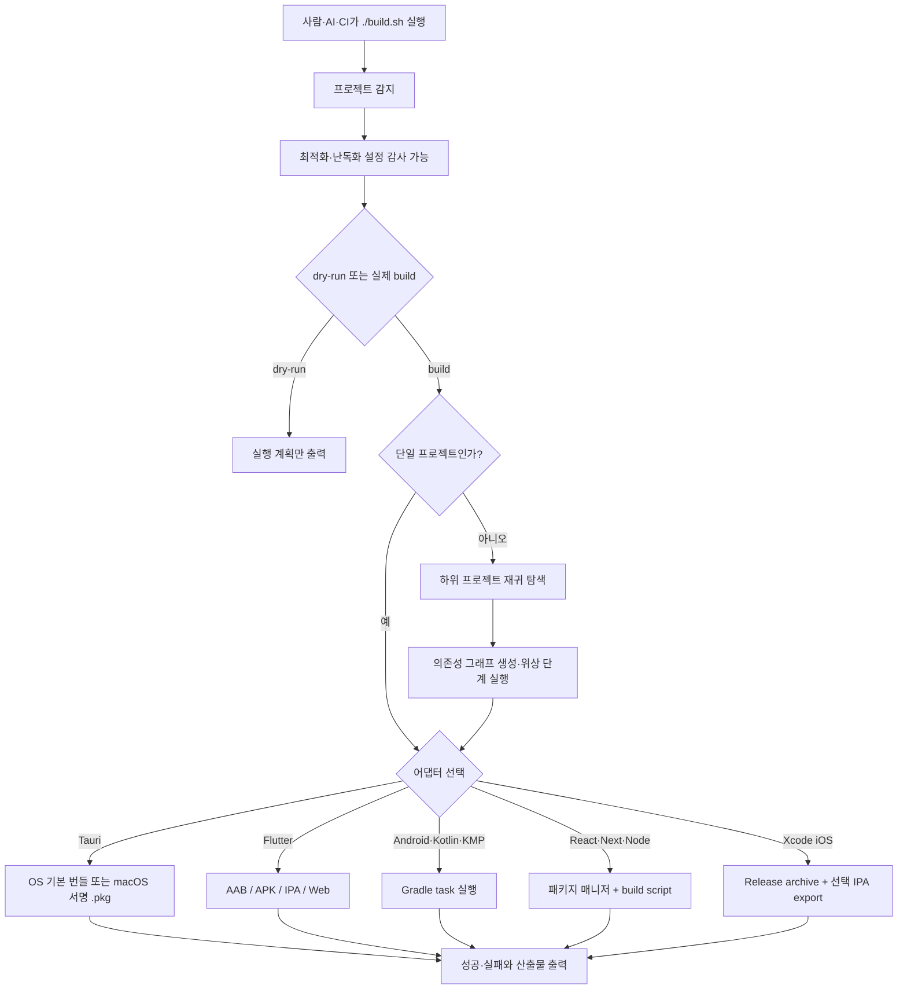

### 감지 우선순위와 중복 제거

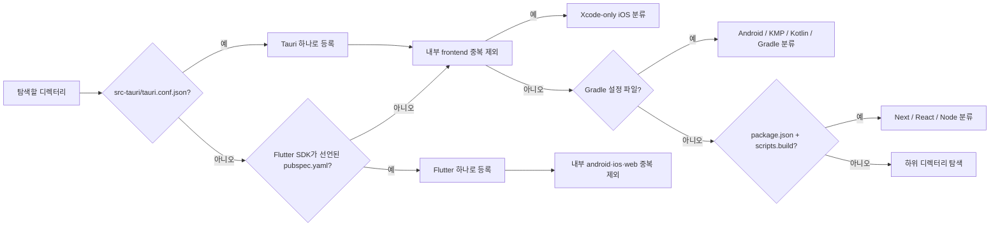

### 실제 빌드와 JSON 리포트

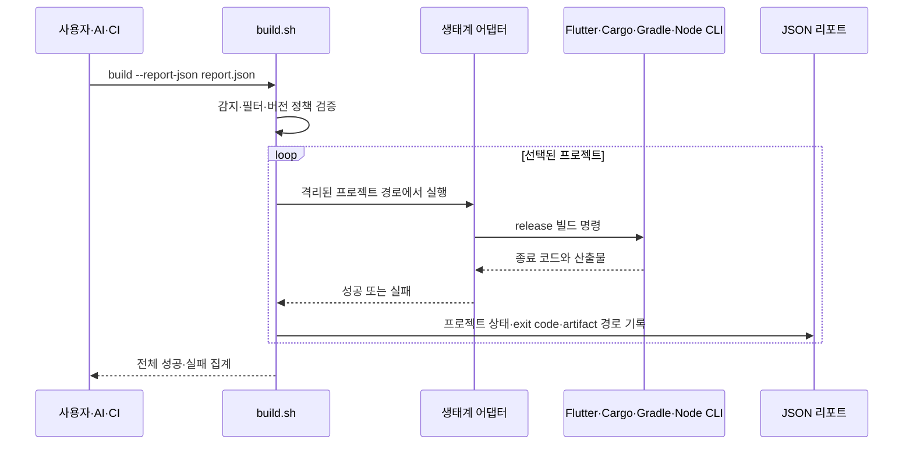

### 다각도 설계 기준

| 관점 | 설계 선택 | 확인 방법 |
|---|---|---|
| 재현성 | 빌드와 UBS 업데이트 분리, 기본 버전 유지 | `plan --json`, `update --check` |
| 보안 | 업데이트 허용 목록·HTTPS·SHA-256·경로 검증 | `tests/test-update.sh` |
| 복구 | 적용 전 백업, 부분 실패 시 롤백 | `.ubs/backups/`와 롤백 테스트 |
| 이식성 | 생태계 CLI에 위임하고 OS 차이만 어댑터가 처리 | Linux/macOS Tauri 모의 테스트 |
| 자동화 | stdout JSON과 stderr 분리, 종료 코드 보존 | `detect/audit/plan --json`, `--report-json` |
| 개인정보 | 환경·서명·서비스 설정·산출물 기본 ignore | `git check-ignore`, CI privacy 검사 |

### 언어 혼용과 책임 경계

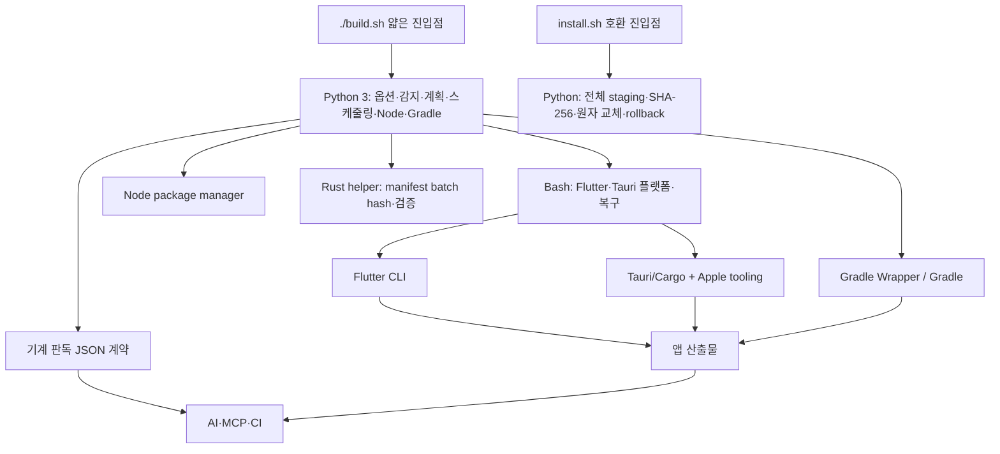

Bash만 고집하지 않습니다. Bash는 설치와 호환성이 좋은 얇은 진입점으로, Python은 구조화 데이터와 안전한 파싱에 사용하며, Rust helper가 있으면 업데이트 무결성 검증을 우선 처리합니다. Rust helper가 없으면 검증된 `sha256sum`/`shasum` fallback을 사용합니다. 실제 컴파일 최적화는 각 생태계의 공식 CLI에 위임하므로 Gradle·Cargo·Flutter 캐시와 프로젝트 설정이 전체 빌드 성능에 더 큰 영향을 줍니다.

### 모노레포 실패 처리

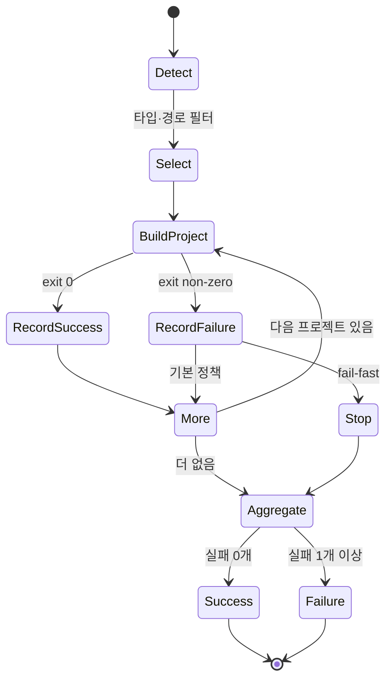

## 지원 범위

감지 순서는 **Tauri → Flutter → Xcode → Gradle → Node**입니다. 상위 생태계를 먼저 확인해 Tauri가 React로, Flutter가 Android/Xcode 프로젝트로 중복 감지되는 것을 방지합니다.

| 타입 | 감지 기준 | 기본 빌드 | 주요 산출물 |
|---|---|---|---|
| Tauri 2 | `src-tauri/tauri.conf.json` | 패키지 매니저의 `tauri build` | OS 기본 번들, macOS 조건 충족 시 `.pkg` |
| Flutter | Flutter SDK가 선언된 `pubspec.yaml` | `flutter build appbundle/ipa` (`auto`) | AAB, APK, IPA, Web, 디버그 심볼 |
| Xcode iOS | 루트의 `*.xcworkspace` 또는 `*.xcodeproj` | Release `xcodebuild archive` | XCArchive, 선택형 IPA export |
| Android | Gradle의 `com.android.application/library` | 앱: `bundleRelease`, 그 외: `build` | Gradle 프로젝트 설정에 따름 |
| Kotlin Multiplatform | Kotlin Multiplatform Gradle 플러그인 | `build` | 타깃별 Gradle 산출물 |
| Kotlin/JVM | Kotlin Gradle 플러그인 | `build` | JAR 등 프로젝트 설정에 따름 |
| 일반 Gradle | Gradle 프로젝트 파일 | `build` | 프로젝트 설정에 따름 |
| Next.js | `package.json`의 `next` + `scripts.build` | `<pm> run build` | 일반적으로 `.next/` |
| React | `package.json`의 `react` + `scripts.build` | `<pm> run build` | Vite 등 도구 설정에 따름 |
| 일반 Node | `package.json`의 `scripts.build` | `<pm> run build` | build script 설정에 따름 |

### 중복 감지 방지

- Tauri 루트에 있는 React/Vite 프런트엔드는 별도 React 프로젝트로 등록하지 않습니다.
- Flutter 내부 `android/`, `ios/`, `macos/`, `linux/`, `windows/`, `web/`은 별도 프로젝트로 등록하지 않습니다.
- 모노레포의 형제 디렉터리에 있는 앱들은 각각 독립 프로젝트로 감지합니다.
- `.git`, `node_modules`, `build`, `dist`, `target`, `.gradle`, `.dart_tool`, `.next`는 재귀 탐색에서 제외합니다.
- `package.json`에 `build` script가 없는 Node 패키지는 빌드 대상에서 제외합니다.

## 명령과 옵션

### 자주 쓰는 명령

```bash
# 단일 앱 또는 모노레포 전체 자동 빌드
./build.sh

# 감지 목록만 출력
./build.sh detect

# AI/CI용 JSON 감지와 최적화·난독화 감사
./build.sh detect --json
./build.sh audit --json
./build.sh plan --json
./build.sh graph --json

# 실제 실행 없이 계획 확인
./build.sh --dry-run

# 특정 프로젝트만 빌드
./build.sh build --project apps/mobile

# 특정 타입만 빌드
./build.sh build --all --type flutter
./build.sh build --all --type react

# 실패 즉시 전체 실행 중단
./build.sh --fail-fast

# 빌드 상태와 발견된 산출물을 JSON 파일로 저장
./build.sh --report-json .ubs/build-report.json

# UBS 전체 런타임 업데이트 확인·미리 보기·적용
./build.sh update --check
./build.sh update --dry-run
./build.sh update
./build.sh update --check --json
./build.sh update --prune-backups 30
```

### 공통 옵션

| 옵션 | 설명 |
|---|---|
| `detect [경로]` | 지정 경로 아래의 프로젝트 목록 출력 |
| `audit [경로]` | 최적화·난독화 관련 설정을 정적으로 감사 |
| `plan [경로]` | 어댑터와 적용 옵션을 실행 없이 계획 |
| `graph [경로]` | 프로젝트 의존성 edge와 위상 layer 출력 |
| `update --check` | 원격 manifest와 로컬 버전·해시 비교 |
| `update --dry-run` | 교체될 관리 파일만 출력 |
| `update` | 검증 다운로드, 백업, 원자적 교체 수행 |
| `update --prune-backups N` | N일을 초과한 `.ubs/backups/` 디렉터리 삭제 |
| `--json` | `detect`/`audit`/`plan`/`graph`와 `update` 결과를 JSON으로 출력 |
| `--report-json <파일>` | 실제 빌드별 종료 상태와 발견된 산출물을 JSON 파일로 저장 |
| `--dry-run` | 어댑터를 실행하지 않고 빌드 계획만 출력 |
| `--interactive` | Flutter/Tauri 버전과 Flutter 플랫폼 선택 메뉴 사용 |
| `--non-interactive` | 안전한 기본값으로 무인 실행. 현재 기본값 |
| `--project <경로>` | 지정 프로젝트와 graph에서 확인된 선행 의존 프로젝트 빌드 |
| `--all` | 지정 루트 아래 감지된 프로젝트 전체 빌드 |
| `--type <타입>` | 전체 빌드에서 정확히 일치하는 타입만 선택 |
| `--version-bump <정책>` | `none`, `build`, `patch`, `minor`, `major` |
| `--flutter-platform <값>` | `auto`, `all`, `ios`, `android` |
| `--flutter-outputs <목록>` | `auto` 또는 `appbundle,apk,ipa,web`의 쉼표 목록 |
| `--clean` | Flutter 빌드 전에 `flutter clean` 실행 |
| `--skip-clean` | Flutter 빌드 캐시 유지. 현재 기본값 |
| `--fail-fast` | 첫 실패에서 전체 빌드 중단 |
| `--jobs <N>` | 독립 프로젝트를 최대 N개씩 병렬 실행; `--fail-fast`는 순차 실행 |

> `build` 버전 정책은 Flutter의 build number 전용입니다. Tauri가 포함된 모노레포 전체에 `--version-bump build`를 적용하면 Tauri 어댑터는 지원하지 않는 정책으로 실패합니다.

### 종료 코드와 실패 처리

| 종료 코드 | 의미 |
|---:|---|
| `0` | 선택된 모든 프로젝트 성공 |
| `1` | 감지 실패, 빌드 실패 또는 선택 대상 없음 |
| `2` | 잘못된 옵션이나 지원하지 않는 값 |

`--fail-fast`가 없으면 같은 위상 단계의 다른 독립 프로젝트는 계속 빌드합니다. 단계가 실패하면 그 결과에 의존하는 후속 단계는 건너뛰며 마지막에 전체·성공·실패·건너뜀 개수를 확인할 수 있습니다.

Flutter와 Tauri의 버전을 올린 뒤 빌드가 실패하거나 취소되면 원래 버전으로 자동 복원합니다. 성공한 경우에만 새 버전을 유지합니다.

### 빌드 완료 후 결과 폴더 열기

로컬 대화형 터미널에서 빌드가 끝나면 성공한 프로젝트의 산출물 폴더를 운영체제 파일 탐색기로 엽니다. Flutter는 공통 `build/`, Tauri는 번들 또는 서명 패키지 폴더, Gradle은 `outputs`/`libs`, Node는 `dist`/`build`/`.next`, Xcode는 `build/ubs`를 엽니다. 여러 프로젝트를 병렬로 빌드해도 전체 실행이 끝난 뒤 한 번씩만 엽니다.

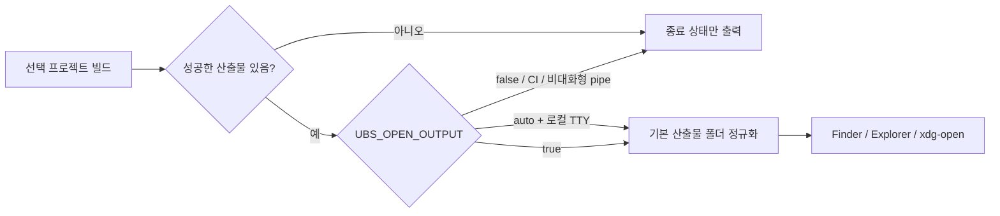

```bash
# 기본: 로컬 터미널에서는 열고 CI·파이프에서는 열지 않음
./build.sh

# CI가 아니어도 강제로 열기
UBS_OPEN_OUTPUT=true ./build.sh

# 항상 열지 않기
UBS_OPEN_OUTPUT=false ./build.sh
```

폴더 열기는 빌드 성공 여부와 분리된 best-effort 동작입니다. 파일 탐색기가 없거나 실행에 실패해도 이미 성공한 빌드를 실패로 바꾸지 않습니다. `UBS_NO_NOTIFY=true`는 macOS 알림만 끄며, 폴더 열기는 `UBS_OPEN_OUTPUT` 또는 호환용 `UBS_NO_OPEN=true`로 별도 제어합니다.

## 빌드 스크립트 업데이트

기본 빌드는 네트워크에서 UBS 코드를 가져오지 않습니다. 업데이트 여부 확인과 적용은 빌드에서 분리된 명령으로 실행합니다.

```bash
# 버전과 관리 파일 무결성만 비교
./build.sh update --check

# 변경될 파일 확인. 다운로드·백업·교체 없음
./build.sh update --dry-run

# 전체 관리 번들 업데이트
./build.sh update

# CI/AI용 구조화된 확인 결과
./build.sh update --check --json

# 30일을 초과한 로컬 업데이트 백업 정리
./build.sh update --prune-backups 30
```

실제 업데이트는 다음 순서로 진행됩니다.

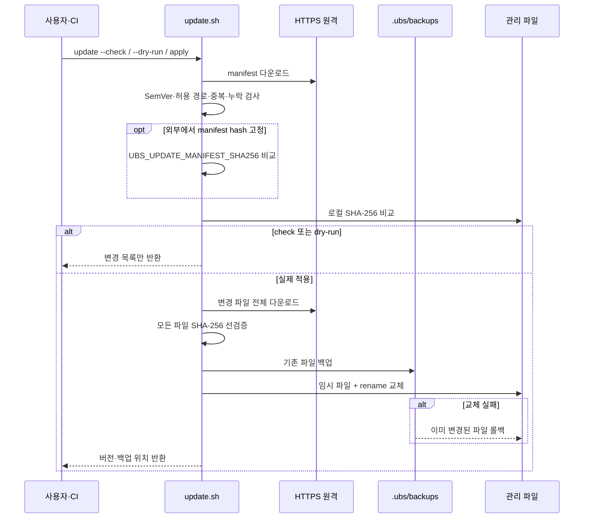

```text
HTTPS manifest 다운로드
  → 허용된 25개 경로·중복·누락 검사
  → 로컬 SHA-256 비교
  → 변경 파일 전체를 임시 폴더에 다운로드
  → SHA-256 전부 검증
  → .ubs/backups/<timestamp>/ 백업
  → 파일별 임시 파일 + rename 교체
  → 실패 시 이미 교체한 파일 복원
```

업데이트 대상은 `build.sh`, 설치기, 어댑터, 감지·감사·업데이트 모듈, 버전 파일, `universal-build` AI 스킬과 원본 Flutter 내보내기 템플릿입니다. 사용자 앱의 소스, README, `.env*`, Apple 서명 파일과 이미 생성된 `ios/ExportOptions.plist`는 덮어쓰지 않습니다.

처음 설치된 구버전에 `update` 명령이 없다면 설치기를 한 번 갱신해야 합니다.

```bash
curl -fsSL https://raw.githubusercontent.com/kimdzhekhon/Universal-Build-Script/main/install.sh \
  | UBS_FORCE=true bash
```

백업은 자동 삭제하지 않습니다. `.ubs/`를 프로젝트 `.gitignore`에 추가하고 `./build.sh update --prune-backups 30`처럼 명시적으로 보존기간을 적용하십시오.

고보증 CI에서는 신뢰한 채널에 기록해 둔 manifest 해시를 `UBS_UPDATE_MANIFEST_SHA256=<64자리 해시>`로 고정할 수 있습니다. 이 값이 있으면 다운로드한 manifest 자체의 SHA-256도 일치해야 업데이트가 진행됩니다.

관리 파일을 개발·배포할 때는 `VERSION`을 올리고 아래 명령으로 manifest를 다시 생성해야 합니다. CI가 manifest와 실제 파일 해시의 차이를 차단합니다.

```bash
scripts/generate-update-manifest.sh > scripts/update-manifest.txt
```

## 개인정보·비밀·산출물 보호

저장소의 `.gitignore`는 실제 환경변수, Apple/Android 서명 자료, 서비스 설정 파일, 의존성 캐시와 빌드 산출물을 기본 제외합니다. `.env.example`과 `.env.macos.example`에는 실제 값을 넣지 말고 플레이스홀더만 유지하십시오.

```bash
# 커밋 전에 추적·미추적 파일 확인
git status --short

# 민감 파일이 무시되는지 확인
git check-ignore .env .env.macos signing/App.provisionprofile build/app.aab
```

Git ignore는 이미 커밋된 파일이나 커밋 작성자 메타데이터를 제거하지 않습니다. 실제 비밀이 과거 이력에 들어갔다면 먼저 해당 비밀을 폐기·재발급하고, 저장소 관리자 승인 아래 이력 재작성 여부를 별도로 결정해야 합니다.

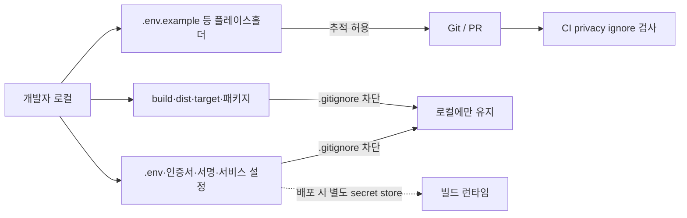

## 프로젝트 의존성 그래프

`./build.sh graph --json`은 프로젝트 사이의 선행 관계와 위상 단계를 읽기 전용 JSON으로 보여줍니다. 실제 다중 프로젝트 빌드도 같은 순서를 사용하며, 한 단계가 실패하면 그 이후 의존 단계는 실행하지 않습니다. 같은 단계에서는 `--jobs N` 범위에서만 병렬화하고 같은 Node workspace·조상/자손 경로는 계속 직렬화합니다.

자동 추론 범위는 다음과 같습니다.

- Node: workspace package의 `dependencies`, `devDependencies`, `optionalDependencies`
- Flutter: `pubspec.yaml`의 `path:` 의존성
- Gradle: `settings.gradle(.kts)`의 `includeBuild(...)`
- 추가 관계: workspace 루트의 `ubs.dependencies.json`

```json
{
  "schema_version": 1,
  "dependencies": {
    "apps/web": ["packages/ui"],
    "apps/mobile": ["packages/shared"]
  }
}
```

키와 값은 workspace 루트 내부의 프로젝트 상대 경로입니다. 루트 탈출 경로와 순환 의존성은 오류로 차단됩니다.

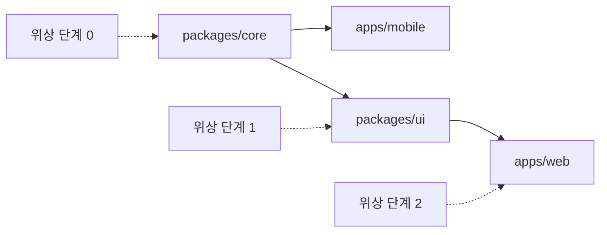

## Flutter 빌드

### 요구 사항

- Flutter SDK와 `flutter` 명령
- Android 빌드: Android SDK 및 서명 설정
- iOS 빌드: macOS, Xcode, Apple 서명 설정
- iOS 내보내기: 앱 내부 `ios/ExportOptions.plist`; 없으면 `templates/flutter/ExportOptions.plist` 일반 템플릿 사용

### 기본 동작

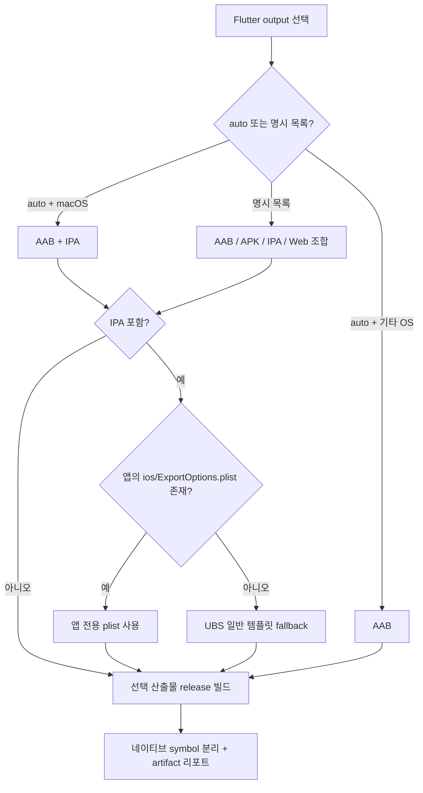

```text
버전 정책 적용
  → 선택적으로 flutter clean
  → flutter pub get
  → Android AAB 및/또는 iOS IPA 릴리스 빌드
  → 결과 경로와 소요 시간 출력
```

- 기본 버전 정책은 `none`입니다.
- 기본 플랫폼 `auto`는 macOS에서 Android+iOS, 그 외 운영체제에서 Android를 선택합니다.
- `--flutter-outputs`를 지정하면 플랫폼 자동 선택을 덮어쓰며 원하는 결과를 조합할 수 있습니다.
- `.env.prod`가 있으면 우선 사용하고, 없으면 `.env`를 사용합니다.
- 두 파일이 모두 없으면 `dart-define` 없이 빌드합니다.
- AAB·APK·IPA에는 `--obfuscate`와 `--split-debug-info`를 적용합니다.
- 모든 출력에 release 빌드와 icon tree shaking을 적용하며, APK는 `--split-per-abi`로 분리합니다.
- Flutter Web은 release 최적화 대상이지만 Flutter 네이티브의 `--obfuscate` 대상은 아닙니다.

```bash
# Play Store AAB + 웹 배포물
./build.sh --flutter-outputs appbundle,web

# ABI별 APK만
./build.sh --flutter-outputs apk

# 네 가지 출력 모두. IPA는 macOS/Xcode/Apple 설정 필요
./build.sh --flutter-outputs appbundle,apk,ipa,web
```

### 결과물

| 대상 | 경로 |
|---|---|
| Android AAB | `build/app/outputs/bundle/release/app-release.aab` |
| Android ABI별 APK | `build/app/outputs/flutter-apk/` |
| Android 디버그 심볼 | `build/app/outputs/symbols/` |
| iOS IPA | `build/ios/ipa/*.ipa` |
| iOS 디버그 심볼 | `build/ios/outputs/symbols/` |
| Flutter Web | `build/web/` |

## Tauri 빌드

Tauri CLI가 지원하는 Windows, macOS, Linux 기본 번들을 빌드합니다. Apple 서명과 App Store용 `.pkg` 후처리만 macOS 전용입니다.

### 요구 사항

- Tauri 2 프로젝트와 `src-tauri/tauri.conf.json`
- Node.js와 프로젝트가 사용하는 패키지 매니저
- Rust/Tauri 빌드 환경
- `.pkg` 생성 시 Apple 인증서, provisioning profile, entitlements

### 패키지 모드

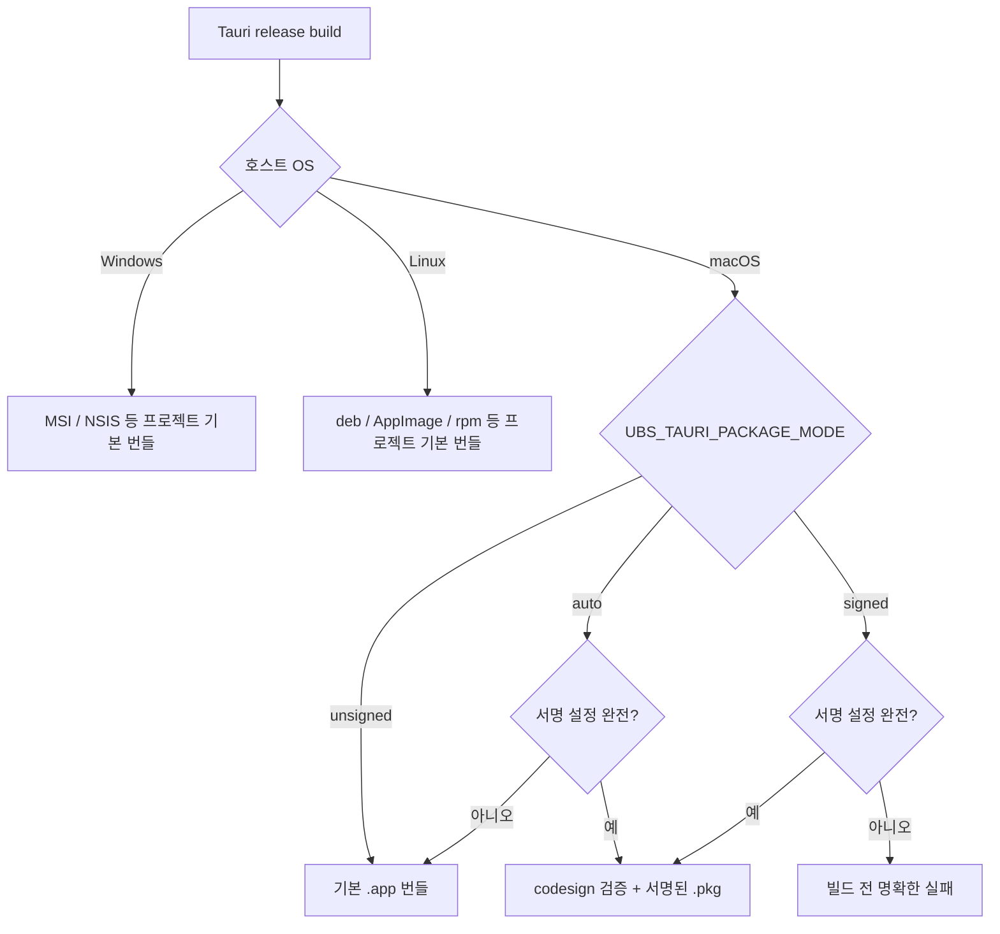

`UBS_TAURI_PACKAGE_MODE`로 결과물을 제어합니다.

| 값 | 동작 |
|---|---|
| `auto` | 기본값. OS 기본 번들 생성; macOS 서명 설정이 완전하면 `.pkg` 생성 |
| `signed` | macOS `.pkg` 필수. 다른 OS 또는 설정 누락 시 빌드 전에 실패 |
| `unsigned` | Apple 서명 후처리를 건너뛰고 OS 기본 번들 생성 |

서명된 `.pkg`에 필요한 값:

```bash
TAURI_SIGN_IDENTITY="Apple Distribution: Your Name (TEAMID)"
TAURI_INSTALLER_IDENTITY="3rd Party Mac Developer Installer: Your Name (TEAMID)"
TAURI_PROVISION_PROFILE=signing/App.provisionprofile
TAURI_ENTITLEMENTS=signing/app.entitlements
```

경로 두 개는 생략할 수 있습니다. 생략하면 `signing/*.provisionprofile`, `signing/*.entitlements`의 첫 번째 파일을 사용합니다.

서명 직전에는 provisioning profile과 `.app` 번들의 quarantine/확장 속성을 `xattr -cr`로 제거해 App Store 검증 오류 가능성을 줄입니다.

### 패키지 매니저 선택

Tauri와 React/Node 어댑터는 같은 선택 규칙을 사용합니다.

1. `package.json`의 `packageManager` 필드
2. `pnpm-lock.yaml`
3. `yarn.lock`
4. `bun.lock` 또는 `bun.lockb`
5. 그 외에는 npm

선택된 명령이 설치되어 있지 않으면 명확한 오류를 출력하고 중단합니다. npm lock 파일이 있으면 `npm ci`, pnpm/bun lock 파일이 있으면 frozen 설치를 사용하며 Yarn Berry는 `--immutable`을 사용합니다.

### 결과물

| 모드 | 경로 |
|---|---|
| `.app` | `src-tauri/target/release/bundle/macos/<productName>.app` |
| 서명된 `.pkg` | `signing/build/<productName>.pkg` |

서명된 `.pkg`는 Transporter를 통해 App Store Connect에 제출할 수 있습니다.

## Android·Kotlin·Gradle 빌드

Python 코어가 Gradle Wrapper를 우선 사용하고, 없으면 시스템 `gradle`을 사용합니다. Version Catalog의 `alias(libs.plugins.android.application)`도 Android application으로 감지합니다.

| 감지 결과 | 기본 task |
|---|---|
| Android application | `bundleRelease` |
| Android library | `build` |
| Kotlin/JVM | `build` |
| Kotlin Multiplatform | `build` |
| 일반 Gradle | `build` |

product flavor, 커스텀 variant 또는 특정 모듈 task가 필요하면 직접 지정합니다.

```bash
UBS_GRADLE_TASK=:app:bundleProdRelease ./build.sh
```

## Xcode-only iOS 빌드

Flutter가 아닌 루트에 `*.xcworkspace` 또는 `*.xcodeproj`가 있으면 `ios-xcode`로 감지합니다. macOS에서 공유 scheme을 자동 탐색해 Release archive를 만들며, scheme이 여러 개로 모호하면 임의 선택하지 않고 `UBS_XCODE_SCHEME`을 요구합니다.

```bash
# archive만 생성
UBS_XCODE_SCHEME=MyApp ./build.sh

# ExportOptions.plist를 사용해 IPA까지 export
UBS_XCODE_SCHEME=MyApp \
UBS_XCODE_EXPORT=true \
UBS_XCODE_EXPORT_OPTIONS=ExportOptions.plist \
./build.sh
```

기본 archive는 `build/ubs/<scheme>.xcarchive`, export 결과는 `build/ubs/export/`에 생성됩니다. 서명 자격과 provisioning은 Xcode 프로젝트 또는 CI keychain에서 관리하며 UBS는 비밀값을 저장하지 않습니다.

## React·Next·Node 빌드

Python 코어가 가장 가까운 Node workspace 루트와 패키지 매니저를 감지해 루트에서 의존성을 설치한 다음 선택한 하위 프로젝트의 `scripts.build`를 실행합니다. 기본 `UBS_INSTALL_MODE=auto`는 workspace package/lock/config/patch와 Node·패키지 매니저 버전이 같고 이전 설치가 성공했다면 install 단계를 생략합니다.

```bash
# 기본 build 대신 build:production 실행
UBS_NODE_BUILD_SCRIPT=build:production ./build.sh

# 이미 의존성이 준비된 CI 또는 로컬 환경
UBS_SKIP_INSTALL=true ./build.sh

# 캐시와 무관하게 의존성을 다시 설치
UBS_INSTALL_MODE=always ./build.sh
```

산출물 위치는 Vite, Next.js, CRA 등 프로젝트의 build script 설정을 따릅니다.

## 환경변수

### UBS 공통 설정

| 환경변수 | 기본값 | 설명 |
|---|---|---|
| `UBS_NON_INTERACTIVE` | `true` | 무인 실행 여부 |
| `UBS_VERSION_BUMP` | `none` | 버전 정책 |
| `UBS_FLUTTER_PLATFORM` | `auto` | Flutter 대상 플랫폼 |
| `UBS_FLUTTER_OUTPUTS` | `auto` | Flutter 산출물 쉼표 목록 |
| `UBS_IOS_EXPORT_OPTIONS` | 앱의 `ios/ExportOptions.plist` | Flutter IPA 내보내기 plist 경로 지정 |
| `UBS_SKIP_CLEAN` | `true` | Flutter clean 생략 |
| `UBS_SKIP_INSTALL` | `false` | Node 의존성 설치 생략 |
| `UBS_INSTALL_MODE` | `auto` | Node 의존성 입력 캐시; `always`로 강제 재설치 |
| `UBS_JOBS` | `1` | 독립 프로젝트 최대 병렬 수 |
| `UBS_GRADLE_TASK` | 자동 | Gradle task 강제 지정 |
| `UBS_GRADLE_OPTIMIZE` | `false` | Gradle `--build-cache --parallel` opt-in |
| `UBS_GRADLE_FLAGS` | 비어 있음 | 추가 Gradle 인자 전달 |
| `UBS_NODE_BUILD_SCRIPT` | `build` | Node build script 이름 |
| `UBS_XCODE_SCHEME` | 자동 | Xcode shared scheme; 여러 scheme이면 필수 |
| `UBS_XCODE_CONFIGURATION` | `Release` | Xcode configuration |
| `UBS_XCODE_EXPORT` | `false` | archive 이후 IPA export 실행 |
| `UBS_XCODE_EXPORT_OPTIONS` | `ExportOptions.plist` | Xcode export plist 경로 |
| `UBS_XCODE_FLAGS` | 비어 있음 | 추가 xcodebuild 인자 |
| `UBS_TAURI_PACKAGE_MODE` | `auto` | Tauri OS 기본 번들/macOS `.pkg` 정책 |
| `UBS_OPEN_OUTPUT` | `auto` | 로컬 TTY에서 성공 산출물 폴더 열기; `true` 강제, `false` 비활성화 |
| `UBS_NO_OPEN` | `false` | 호환용 결과 폴더 열기 비활성화 스위치 |
| `UBS_NO_NOTIFY` | `false` | macOS 소리·음성·완료 알림 생략 |
| `UBS_ALLOW_SELF_UPDATE` | 폐기됨 | 개별 어댑터 교체를 하지 않고 중앙 `./build.sh update` 사용 안내 |
| `UBS_UPDATE_BASE_URL` | 공식 `main` raw URL | 사설 mirror 또는 테스트용 업데이트 기준 URL |
| `UBS_UPDATE_ALLOW_DOWNGRADE` | `false` | 더 낮은 SemVer 적용을 명시적으로 허용 |
| `UBS_UPDATE_MANIFEST_SHA256` | 비어 있음 | 신뢰 채널에서 받은 업데이트 manifest 해시 고정 |
| `UBS_BUILD_RUST_HELPER` | `false` | 설치 시 선택형 Rust helper release 빌드 |
| `UBS_RUST_HELPER` | 자동 | 별도 Rust helper 실행 파일 경로 지정 |
| `UBS_FORCE` | `false` | 설치 프로그램에서 기존 UBS 파일 덮어쓰기 |
| `UBS_MANAGE_GITIGNORE` | `true` | 설치 대상에 환경·서명·캐시 보호 ignore 블록 추가 |
| `UBS_INSTALL_REF` | 현재 release tag | 설치기가 받을 불변 Git ref |
| `UBS_MCP_ROOT` | 서버 시작 디렉터리 | MCP가 접근할 수 있는 workspace 경계 |
| `UBS_MCP_ALLOW_BUILD` | `false` | MCP 실제 빌드 도구를 명시적으로 노출 |

### Tauri 전용 설정

`.env.macos`에서는 다음 키만 읽습니다.

- `TAURI_SIGN_IDENTITY`
- `TAURI_INSTALLER_IDENTITY`
- `TAURI_PROVISION_PROFILE`
- `TAURI_ENTITLEMENTS`
- `TAURI_OBFUSCATE_JS`

`.env.macos`는 `source`로 실행하지 않고 허용된 값을 문자열로 파싱합니다. 셸 표현식이나 명령 치환은 실행되지 않습니다.

## 환경변수와 보안

- Flutter의 `dart-define` 값은 컴파일된 앱에서 추출될 수 있습니다.
- React/Vite의 `VITE_*` 값은 프런트엔드 번들에 포함됩니다.
- Supabase anon key처럼 공개 사용을 전제로 한 값만 클라이언트 빌드에 넣고, 서버 비밀키·service-role key·개인 API key는 넣지 마십시오.
- `.env`, `.env.prod`, `.env.macos`, provisioning profile 및 entitlements는 저장소 정책에 맞게 보호하십시오.
- 개별 Flutter/Tauri 자체 업데이트는 폐기됐습니다. manifest 검증·백업·rollback을 적용하는 중앙 `./build.sh update`만 사용합니다.
- manifest 해시는 손상·불완전 다운로드를 탐지하지만, manifest와 파일이 같은 GitHub 채널에서 제공되므로 독립적인 서명 검증은 아닙니다.
- 업데이트는 HTTPS만 허용하고 지정된 관리 경로 밖이나 심볼릭 링크 경로에는 쓰지 않습니다.
- `curl | bash` 설치는 원격 스크립트를 즉시 실행합니다. 민감한 환경에서는 `install.sh`를 먼저 내려받아 검토한 다음 실행하십시오.

## 최적화와 난독화 감사

```bash
./build.sh audit
./build.sh audit --json
./build.sh audit --json --type flutter /workspace
```

감사는 어댑터 정책과 프로젝트 설정 파일을 읽는 **정적 점검**입니다. 실제 산출물을 디컴파일하거나 성능 측정·서명 검증·재현 빌드하는 인증 절차가 아닙니다. 따라서 “release/minify 성공”을 “모든 코드가 난독화됨”으로 표현하지 않습니다.

| 상태 | 의미 |
|---|---|
| `enforced` | UBS 어댑터가 해당 옵션을 항상 전달 |
| `configured` | 인식 가능한 프로젝트 설정을 발견 |
| `framework-default` | 알려진 production 프레임워크 기본 처리에 위임 |
| `compiled` | 네이티브 release 컴파일이며 난독화 보장은 아님 |
| `recommended` | 선택적 크기·하드닝 설정 검토 권장 |
| `optional-off` | 기능은 있으나 기본적으로 꺼짐 |
| `not-configured` | 기대 설정을 찾지 못함 |
| `not-supported` | 해당 출력에서 그 방식은 지원되지 않음 |
| `unknown` / `project-specific` | 정적 규칙만으로 판정하기 어려움 |

### 스택별 실제 보장 범위

| 스택·출력 | 최적화 | 난독화 | 별도 확인 사항 |
|---|---|---|---|
| Flutter AAB/APK/IPA | release AOT, icon tree shaking | `--obfuscate` 강제 | `split-debug-info` 심볼을 안전하게 보관 |
| Flutter Web | release compiler, tree shaking | 네이티브 Dart 난독화 옵션 미지원 | minify 결과를 난독화로 간주하지 않음 |
| Tauri Rust | Cargo release; LTO/strip 설정 감지 | 네이티브 컴파일 자체는 난독화 보장이 아님 | `Cargo.toml` release profile과 바이너리 확인 |
| Tauri frontend | Vite/Next/CRA production 처리 감지 | `TAURI_OBFUSCATE_JS=true`일 때만 추가 처리 | `dist/` 전제, 런타임 회귀·크기 증가 테스트 |
| Android | release의 R8/minify, resource shrink 설정 감지 | R8 규칙이 연결된 경우에만 근거 표시 | mapping 파일 보관, reflection/serialization 테스트 |
| Kotlin/JVM/KMP/Gradle | 프로젝트의 Gradle task에 위임 | 자동 보장하지 않음 | 타깃별 패키징·ProGuard/R8/plugin 확인 |
| Xcode iOS | Release archive 강제 | native compile/strip 설정 감지만 제공 | dSYM·서명·ExportOptions·실기기 회귀 확인 |
| React/Next/Node | 인식한 프레임워크 production build에 위임 | 별도 패키지·설정이 있을 때만 감지 | SSR/server bundle과 source map 노출 점검 |

추가로 서명은 게시자 신원과 무결성을 위한 절차이며 최적화·난독화와 별개입니다. 높은 보증 수준이 필요하면 빌드 로그, 산출물 크기, source map·symbol·mapping 보관 여부, 실제 디컴파일 결과, 서명 검증을 생태계별 도구로 확인해야 합니다.

## 아키텍처

```text
Universal-Build-Script/
├── VERSION                          # 전체 관리 번들 버전
├── .github/dependabot.yml            # 고정된 Actions 의존성 갱신
├── .github/workflows/validate.yml   # Bash·동작·AI 스킬 CI 검증
├── build.sh                         # 사용자 진입점·실행 집계
├── install.sh                       # 전체 런타임 설치
├── scripts/
│   ├── ubs.py                       # Python 감지·그래프·위상 실행·Node·Gradle·Xcode 코어
│   ├── ubs_mcp.py                   # 경로 제한·읽기 전용 기본 stdio MCP 서버
│   ├── bootstrap-update.sh          # Python 코어 누락 시 복구 업데이트
│   ├── build-rust-helper.sh         # 선택형 Rust release helper 빌드
│   ├── lib/
│   │   ├── detect.sh                # 레거시 호환 감지 모듈·회귀 테스트
│   │   ├── audit.sh                 # 레거시 호환 감사 모듈·회귀 테스트
│   │   ├── update.sh                # 검증·백업·롤백 업데이트
│   │   └── node-package-manager.sh  # npm/pnpm/yarn/bun 공통 처리
│   ├── generate-update-manifest.sh  # 관리 파일 SHA-256 manifest 생성
│   ├── update-manifest.txt          # 배포 버전·허용 파일 해시
│   ├── build-flutter.sh             # Flutter AAB/APK/IPA/Web
│   ├── build-tauri.sh               # Tauri 크로스플랫폼 진입점
│   ├── build-tauri-macos.sh         # 공통 빌드 + macOS app/pkg 후처리
│   ├── build-gradle.sh              # Python core 레거시 호환 wrapper
│   ├── build-node.sh                # Python core 레거시 호환 wrapper
│   ├── FLUTTER_VERSION
│   └── TAURI_VERSION
├── native/ubs-helper/               # SHA-256·안전 상대경로 Rust CLI
│   ├── Cargo.toml
│   ├── Cargo.lock
│   └── src/main.rs
├── templates/flutter/ExportOptions.plist # 설치용 일반 IPA 내보내기 템플릿
├── skills/universal-build/          # AI용 안전 실행 스킬과 감사 기준
├── tests/test-detection.sh
├── tests/test-install.sh
├── tests/test-python-adapters.sh
├── tests/test-update.sh
├── tests/test-rust-helper.sh
├── tests/test_python_core.py
├── tests/test_mcp.py
├── .env.example
└── .env.macos.example
```

어댑터는 프로젝트 디렉터리를 현재 작업 디렉터리로 받아 실행됩니다. 새 생태계를 추가할 때는 감지 규칙과 어댑터 매핑을 확장하는 방식입니다.

## 테스트

```bash
bash tests/test-detection.sh
bash tests/test-install.sh
bash tests/test-python-adapters.sh
bash tests/test-update.sh
bash tests/test-rust-helper.sh
python3 tests/test_python_core.py
python3 tests/test_mcp.py
```

현재 테스트는 임시 모노레포를 만들고 다음을 검증합니다.

- Tauri+React를 Tauri 하나로 감지
- Flutter 내부 Android 중복 제거
- 독립 Android, Kotlin Multiplatform, Xcode iOS, React 감지
- Node/Flutter/Gradle/명시 의존성 그래프와 순환 차단, 위상 실행
- MCP initialize·tool list/call·workspace 탈출 차단·build opt-in
- 인자 없는 `./build.sh`의 모노레포 자동 전환
- dry-run 프로젝트 수
- JSON 감지 결과와 감사 스키마
- JSON 계획의 어댑터·스택별 옵션
- 업데이트 check/dry-run/적용, 백업과 SHA-256 검증
- 악성 manifest 경로와 심볼릭 링크 차단
- Flutter/Tauri/Android/React 감사 상태 판정
- Android 기본 `bundleRelease` 선택
- npm lock 파일의 `npm ci` 선택
- Flutter 성공 시 버전 유지 및 실패 시 원상 복구
- Flutter AAB·ABI별 APK·Web 다중 출력 명령
- `.env`가 없는 Flutter 실행 경로
- `.env.macos`의 명령 치환이 실행되지 않음
- 서명 설정이 없는 Tauri의 `.app` 대체 경로
- Tauri signed 모드의 quarantine 속성 제거와 `.pkg` 생성
- 얇은 Bash 진입점과 Python 코어 CLI 호환성
- Python 코어 누락 시 bootstrap update 복구
- Rust SHA-256 표준 벡터·경로 검증·업데이트 연동
- Version Catalog Android 감지와 Python Gradle task 선택
- Node dependency 입력 캐시와 제한 병렬 프로젝트 선택
- 설치기 원자 교체·심볼릭 링크 방어·개인정보 ignore 보강

테스트는 실제 Flutter SDK, Gradle, npm, Apple 인증서를 사용하지 않고 모의 명령으로 실행됩니다. 실제 AAB·APK·IPA·Web·PKG 생성과 산출물 수준의 난독화 검증은 각 프로젝트 환경에서 별도로 확인해야 합니다.

## 문제 해결

### 프로젝트가 감지되지 않음

```bash
./build.sh detect
```

- Flutter는 `pubspec.yaml`에 Flutter SDK 선언이 있어야 합니다.
- Node는 `package.json`에 문자열 형태의 `scripts.build`가 있어야 합니다.
- 재귀 Gradle 탐색은 `settings.gradle` 또는 `settings.gradle.kts`를 프로젝트 루트 기준으로 사용합니다.

### Flutter가 iOS까지 빌드해서 실패함

macOS의 `auto` 기본값은 Android+iOS입니다. Android만 필요하면:

```bash
./build.sh --flutter-platform android
```

필요한 산출물을 더 정확히 지정하려면 플랫폼 대신 출력 목록을 사용합니다.

```bash
./build.sh --flutter-outputs appbundle,apk
```

### Android flavor task를 찾지 못함

```bash
UBS_GRADLE_TASK=:app:bundleProdRelease ./build.sh
```

### Tauri에서 `.pkg` 대신 `.app`만 생성됨

서명 identity, provisioning profile, entitlements 중 하나 이상이 없습니다. 누락을 즉시 확인하려면:

```bash
UBS_TAURI_PACKAGE_MODE=signed ./build.sh
```

### 패키지 매니저를 찾지 못함

`package.json`의 `packageManager` 필드 또는 lock 파일이 선택한 npm/pnpm/yarn/bun 명령을 설치하십시오. `packageManager` 선언과 실제 lock 파일도 일치시키는 것이 좋습니다.

### 전체 빌드 중 한 프로젝트 실패

기본값은 나머지 프로젝트를 계속 실행합니다. 첫 실패에서 멈추려면:

```bash
./build.sh --fail-fast
```

## 알려진 제한 사항

- 기본은 순차 실행이며 `--jobs N`에서 경로가 겹치거나 같은 Node workspace를 쓰는 프로젝트는 자동으로 같은 직렬 그룹에 배치합니다.
- 의존성 자동 추론은 Node package 이름, Flutter `path:`, Gradle `includeBuild` 범위입니다. 그 밖의 생성 코드·원격 artifact·사용자 정의 task 관계는 `ubs.dependencies.json`에 명시해야 합니다.
- Xcode scheme이 여러 개이고 container 이름과 일치하는 scheme이 없으면 `UBS_XCODE_SCHEME`을 지정해야 합니다.
- Gradle product flavor와 커스텀 task는 자동 추론하지 않습니다.
- Kotlin Multiplatform의 플랫폼별 배포 task는 자동 선택하지 않고 기본 `build`만 실행합니다.
- Tauri JS 난독화는 `dist/`를 가정하며 lockfile에 설치된 로컬 `javascript-obfuscator`만 실행합니다.
- Tauri 산출물 검색은 기본 `src-tauri/target/release/bundle` 구조를 전제로 합니다.
- 모노레포 설치 시 하위 앱별 `.env`, Apple 서명 파일과 플랫폼 설정은 자동 생성하지 않습니다.
- `audit`는 알려진 설정 패턴만 찾으며 커스텀 플러그인·간접 Gradle 설정·실제 바이너리 상태를 완전히 증명하지 않습니다.
- `--report-json`은 알려진 기본 출력 경로를 검색하므로 프로젝트가 산출물을 다른 위치로 옮기면 목록에 나타나지 않을 수 있습니다.
- 자동 폴더 열기도 같은 산출물 탐색 규칙을 사용하므로 커스텀 출력 경로는 열리지 않을 수 있습니다. 이 경우 `--report-json` 결과와 실제 build script를 함께 확인하십시오.
- 업데이트 manifest는 선택적으로 SHA-256을 외부에서 고정할 수 있지만 별도 전자서명·투명성 로그는 제공하지 않습니다.

## Roadmap

- [x] Flutter/Tauri 우선순위 감지와 내부 프로젝트 중복 제거
- [x] 단일 프로젝트·모노레포 자동 전환
- [x] Flutter AAB/APK/IPA/Web 선택 출력, 네이티브 난독화, 심볼 분리
- [x] Tauri macOS `.app` 및 서명된 `.pkg`
- [x] Android/Kotlin/Kotlin Multiplatform/일반 Gradle 어댑터
- [x] React/Next/일반 Node 어댑터
- [x] npm/pnpm/yarn/bun 자동 선택
- [x] dry-run, 타입 필터, 지정 프로젝트, fail-fast
- [x] 비대화형 기본 실행과 대화형 선택 모드
- [x] 실패·취소 시 Flutter/Tauri 버전 복원
- [x] Tauri `.env.macos` 안전 파싱
- [x] AI 스킬과 MCP 래퍼용 JSON 감지·감사 계약
- [x] AI/MCP용 읽기 전용 JSON 빌드 계획
- [x] 스택별 최적화·난독화 정적 감사
- [x] Bash 동작과 AI 스킬 메타데이터 GitHub Actions 검증
- [x] 전체 관리 번들 check/dry-run/SHA-256/백업·롤백 업데이트
- [x] 업데이트 JSON, manifest 해시 핀, 명시적 백업 보존기간 정리
- [x] Tauri Windows/Linux 기본 번들 빌드
- [x] 구조화된 JSON 빌드 리포트와 CI artifact manifest
- [x] 프로젝트 의존성 그래프와 위상 정렬
- [x] workspace·조상/자손 충돌을 직렬화하는 제한 병렬 빌드
- [x] Xcode-only iOS 네이티브 어댑터
- [x] 선택형 로컬 MCP 서버 패키지

## 라이선스

MIT License — Copyright © 2026 kimdzhekhon
