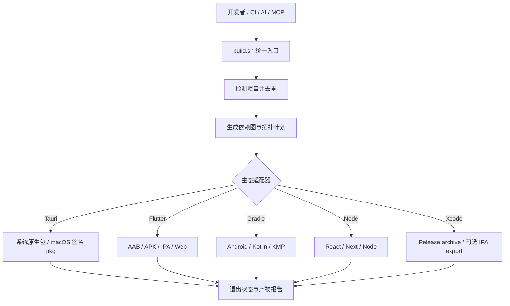
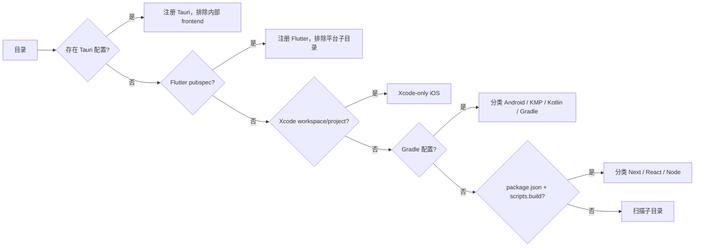
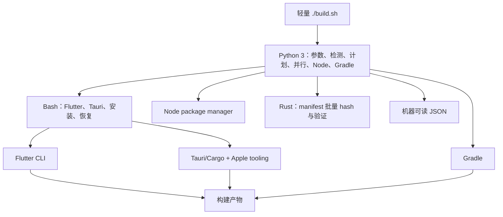
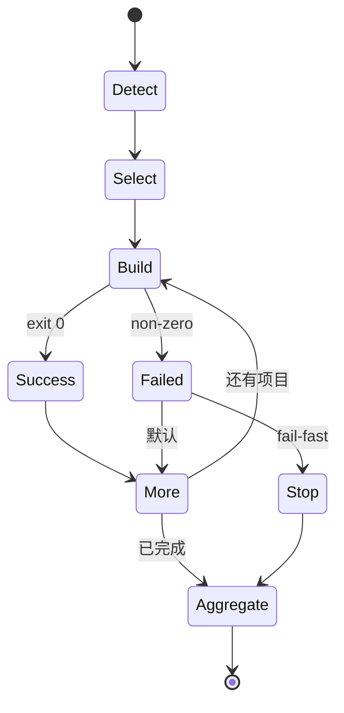
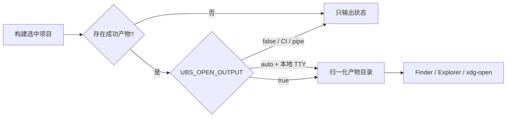
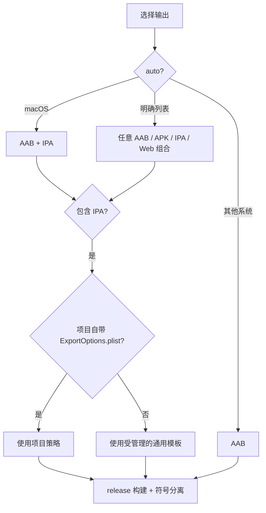
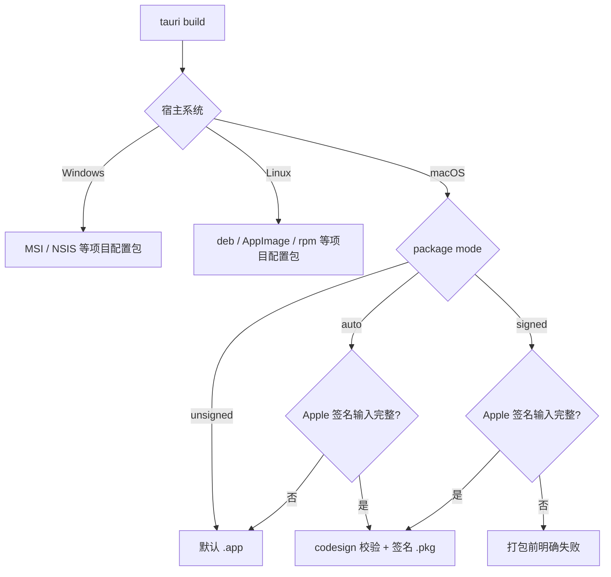
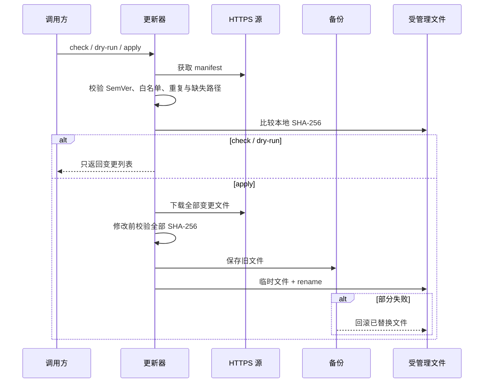
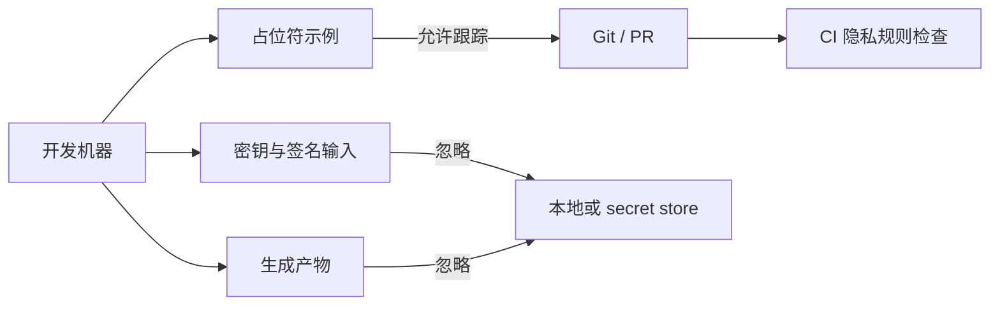

<div align="center">

# Universal Build Script

[한국어](README.md) · [English](README.en.md) · [日本語](README.ja.md) · [简体中文](README.zh-CN.md)

**只需一个 `./build.sh`，即可检测并构建 Flutter、Tauri、Xcode iOS、Android/Kotlin/Gradle、React、Next.js 和 Node；开发者、CI、AI 与 MCP 共用同一套规则。**

[快速开始](#快速开始) · [架构](#架构与执行流程) · [命令](#主要命令) · [安全更新](#安全的运行时更新) · [已知限制](#已知限制)

</div>

## 概览

脚本会判断当前目录是单项目还是 monorepo，检测可构建项目，排除嵌套重复项，并把每个项目交给对应的生态适配器。

3.3 由 Python 3 从 Node workspace、Flutter path、Gradle composite 和显式配置推断项目依赖，并按拓扑层执行；同时加入 Xcode-only iOS adapter，以及无需外部包、限制 workspace root 的 stdio MCP server。

| 维度 | 默认行为 |
|---|---|
| 交互 | 非交互，适合 CI |
| 版本 | 未明确要求时保持不变 |
| Monorepo | 按项目依赖拓扑顺序构建 |
| Flutter | macOS 默认 AAB+IPA，其他系统默认 AAB |
| Tauri | 生成系统原生包；macOS 签名配置完整时生成 `.pkg` |
| 失败 | 默认继续其他项目，最后汇总失败 |
| UBS 更新 | 与普通构建完全分离 |

## 快速开始

```bash
curl -fsSL https://raw.githubusercontent.com/kimdzhekhon/Universal-Build-Script/main/install.sh | bash

./build.sh detect
./build.sh audit
./build.sh plan --json
./build.sh graph --json
./build.sh
```

需要 Python 3.9 或更高版本，Rust 为可选项：

```bash
./scripts/build-rust-helper.sh
# 或以 UBS_BUILD_RUST_HELPER=true 运行 install.sh
```

> **从 2.x 升级到 3.x：** 请使用 `UBS_FORCE=true` 运行一次安装器。安装 3.x 后，`./build.sh update` 会管理完整的 25 文件运行时。

安装器默认使用不可变的 current release ref。可配置 `UBS_INSTALL_REF`、`UBS_JOBS`、`UBS_INSTALL_MODE`、`UBS_MANAGE_GITIGNORE`、`UBS_GRADLE_FLAGS` 和 `UBS_GRADLE_OPTIMIZE`。

构建指定产物并生成结构化报告：

```bash
./build.sh \
  --flutter-outputs appbundle,web \
  --version-bump none \
  --report-json .ubs/build-report.json
```

## 架构与执行流程



### 检测优先级



优先级为 **Tauri → Flutter → Xcode → Gradle → Node**，避免重复识别 Tauri/Flutter 内部项目。

### 语言职责边界



可用 `--jobs N` 对独立项目进行受限并行构建。Node 在 package/lock 输入未变化时跳过重复安装，使用 `UBS_INSTALL_MODE=always` 可强制重装。没有 Rust helper 时仍使用可移植 fallback。

### Monorepo 失败策略



## 支持范围

| 类型 | 检测条件 | 默认构建 | 常见产物 |
|---|---|---|---|
| Tauri 2 | `src-tauri/tauri.conf.json` | `tauri build` | 系统原生包；可选 macOS `.pkg` |
| Flutter | `pubspec.yaml` 声明 Flutter SDK | 所选 release 输出 | AAB、分 ABI APK、IPA、Web、symbols |
| Xcode iOS | `*.xcworkspace` / `*.xcodeproj` | Release archive | XCArchive、可选 IPA |
| Android | Android Gradle plugin | app 使用 `bundleRelease` | 由 Gradle 项目决定 |
| Kotlin/KMP/Gradle | Gradle plugin 与 settings | `build` | JAR 或目标平台产物 |
| Next/React/Node | 字符串形式的 `scripts.build` | 包管理器 build script | `.next`、`dist`、`build` 等 |

递归扫描会排除 `.git`、`node_modules`、`build`、`dist`、`target`、`.gradle`、`.dart_tool` 与 `.next`。

## 主要命令

```bash
# 只读检测、审计、计划
./build.sh detect --json /workspace
./build.sh audit --json /workspace
./build.sh plan --json /workspace
./build.sh graph --json /workspace

# 单项目或筛选后的 monorepo
./build.sh build --project apps/mobile
./build.sh build --all --type flutter

# 明确指定 Flutter 产物
./build.sh --flutter-outputs appbundle,apk,ipa,web

# 首次失败即停止
./build.sh --fail-fast

# 结构化构建报告
./build.sh --report-json .ubs/build-report.json
```

| 选项 | 含义 |
|---|---|
| `--version-bump none|build|patch|minor|major` | 应用版本策略 |
| `--flutter-outputs auto|LIST` | AAB/APK/IPA/Web 的组合 |
| `--project PATH` | 只构建一个已检测项目 |
| `--all --type TYPE` | 按类型筛选 monorepo |
| `--clean` / `--skip-clean` | Flutter 缓存策略 |
| `--report-json PATH` | 保存项目状态、退出码和产物路径 |

退出码 `0` 表示全部成功，`1` 表示检测/构建失败或没有匹配项目，`2` 表示参数无效。

## 构建完成后打开产物目录

所有选中项目执行结束后，本地交互式终端会通过 Finder、Explorer 或 `xdg-open` 打开成功产物的位置。Flutter 归并到 `build/`，Tauri 打开 bundle 或签名包目录，Gradle 打开 outputs/libs，Node 打开 `dist`/`build`/`.next`，Xcode 打开 `build/ubs`。



默认 `UBS_OPEN_OUTPUT=auto`，不会在 CI 或非交互管道中隐式打开 GUI。设置 `true` 可强制打开，设置 `false` 可禁用，`UBS_NO_OPEN=true` 是兼容关闭开关。打开目录属于 best-effort，失败不会把成功构建改成失败；`UBS_NO_NOTIFY` 仅控制 macOS 通知。

## Flutter 产物流



原生 Flutter 产物使用 release、obfuscation 与 split debug info。Web 使用 release 优化与 tree shaking，但不适用原生 Dart 混淆。

## Tauri 平台流



包管理器按 `packageManager`、pnpm/Yarn/Bun lock 文件、npm 的顺序选择，并在支持时使用 frozen/immutable 安装。

## 安全的运行时更新

普通构建不会下载 UBS 代码。更新必须显式执行：

```bash
./build.sh update --check
./build.sh update --dry-run
./build.sh update
./build.sh update --check --json
./build.sh update --prune-backups 30
```



更新器阻止路径穿越、符号链接目标、并发写入以及未授权降级。高保证 CI 可设置 `UBS_UPDATE_MANIFEST_SHA256` 固定 manifest，但它不能替代独立签名或透明日志。

## 隐私、密钥与产物

`.gitignore` 默认排除真实环境文件、Apple/Android 签名材料、服务配置、依赖缓存和生成包。example 文件只能保存占位符。



Ignore 规则不会删除已跟踪文件或提交作者元数据。如果凭据曾泄漏，应先撤销并重新签发，再决定是否重写历史。

## AI 与 MCP

仓库包含 [`skills/universal-build`](skills/universal-build/SKILL.md)，安全执行顺序为：

```text
detect --json → audit --json → plan --json → 用户明确授权 → build --report-json
```

使用 `python3 /ABSOLUTE/PATH/scripts/ubs_mcp.py` 可启动无需外部包的 stdio server，并通过 `UBS_MCP_ROOT` 固定允许的 workspace。默认只提供 `ubs_detect`、`ubs_audit`、`ubs_plan`、`ubs_graph`、`ubs_update_check`。仅当 `UBS_MCP_ALLOW_BUILD=true` 时才公开 `ubs_build`，真实构建还必须传入 `confirm=true`。

### 依赖图与 Xcode

`./build.sh graph --json` 从 Node package、Flutter `path:`、Gradle `includeBuild(...)` 与 `ubs.dependencies.json` 生成 `nodes`、`edges` 和拓扑 `layers`；循环和 workspace 外路径会被拒绝。

```json
{"schema_version":1,"dependencies":{"apps/web":["packages/ui"]}}
```

Xcode-only 根目录会识别为 `ios-xcode`，并在 macOS 上创建 Release archive。多 scheme 时使用 `UBS_XCODE_SCHEME`；导出 IPA 时设置 `UBS_XCODE_EXPORT=true` 与 `UBS_XCODE_EXPORT_OPTIONS`。

## 验证

```bash
bash -n build.sh install.sh scripts/*.sh scripts/lib/*.sh tests/*.sh
python3 tests/test_python_core.py
python3 tests/test_mcp.py
bash tests/test-detection.sh
bash tests/test-install.sh
bash tests/test-python-adapters.sh
bash tests/test-update.sh
bash tests/test-rust-helper.sh
```

测试使用临时 fixture 和模拟 CLI。真实 SDK 构建、签名以及产物级逆向验证仍需在具体项目环境中执行。

## 已知限制

- 默认串行执行。`--jobs N` 只并行同一拓扑层内无冲突的项目。
- 自动推断范围之外的生成代码或自定义 task 关系需要写入 `ubs.dependencies.json`。
- 多个 Xcode scheme 无法消歧时必须设置 `UBS_XCODE_SCHEME`。
- Gradle flavor、自定义 release task、KMP 发布 task 可能需要覆盖配置。
- Tauri JS 混淆假定前端输出目录为 `dist/`。
- 产物报告只搜索已知的默认输出路径。
- 自动打开目录使用同一套产物规则，因此自定义输出路径可能需要手动打开。
- 更新 manifest 支持外部 hash pin，但没有独立签名或透明日志。

## 许可证与外部代码

MIT License — Copyright © 2026 kimdzhekhon。如果作品在 2026 年首次创作并公开，`2026` 更合适；只有能证明存在 2024 年的早期作品或首次公开时，才使用 `2024–2026`。参见[美国版权局 notice 指南](https://www.copyright.gov/circs/circ03.pdf)、[OSI MIT License](https://opensource.org/license/MIT)和 [LICENSE](LICENSE)。

可以研究其他开源项目的思想、公开 API 和通用设计模式，但不能把复制的代码或文字拆成小片段来掩盖来源。引入实现前必须确认许可证兼容性，并保留要求的版权、LICENSE、NOTICE 和出处。GPL/AGPL 等义务不同的代码未经专门审查不要混入。本次产物目录功能是针对本仓库独立实现的。
